**How the Rust Compiler Works, a Deep Dive - Video Highlights**

```
This is a transcription of a YouTube video. Among the relevant resources for learning more about Rust compiler, I found this video particularly interesting.

This content presents the opinions and perspectives of industry experts or other individuals. The opinions expressed in this content do not necessarily reflect my opinion.

Readers are encouraged to verify the information on their own and seek professional advice before making any decisions based on this content.
```

----
In this video, **Daniel Cumming** a formal verification engineer at **Runtime Verification** and Rust instructor at **RareSkills** explains how the Rust compiler works under the hood.

This talk will explain the **Rust compiler pipeline** of

- Source code
- Abstract Syntax Tree
- High Intermediate Representation
- Typed-High Intermediate Representation
- Middle Intermediate Representation
- LLVM Intermediate Representation
- Codegen Backend
- Adding callbacks to compilation
- Building the Rust Compiler

----
<table>
<tr>

  <td>
    <li><a href="https://runtimeverification.com">Website</a></li>
    <li><a href="https://x.com/rv_inc">Twitter: @rv_inc</a></li>
    <li><a href="https://discord.com/invite/CurfmXNtbN">Discord</a></li>
    <li><a href="mailto:contact@runtimeverification.com">Mail</a></li>
  </td>

  <td>
    <li>RareSkills Rust Bootcamp: https://rareskills.io/rust-bootcamp</li>
    <li>Runtime Verification: https://runtimeverification.com</li>
  </td>

</tr>
</table>

----

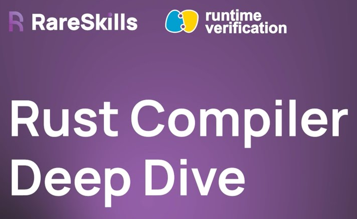

# [00:00](https://youtu.be/Ju7v6vgfEt8?t=0)  Introduction to Rust and the Rust Compiler

## Overview of the Presentation
- [00:00](https://youtu.be/Ju7v6vgfEt8?t=0)  Daniel introduces himself as a formal verification engineer at Runtime Verification, focusing on Rust and its compiler.
- [00:28](https://youtu.be/Ju7v6vgfEt8?t=28)  He acknowledges the ambitious goal of covering a complex topic within an hour, likening it to fitting a school bus into a living room.
- [00:52](https://youtu.be/Ju7v6vgfEt8?t=52)  Daniel checks if everyone can see his screen share and adjusts his presentation setup for better visibility.Structure of the Talk
- [01:15](https://youtu.be/Ju7v6vgfEt8?t=75)  The presentation will begin with a brief overview of Rust as a language (3-5 minutes).
- [01:46](https://youtu.be/Ju7v6vgfEt8?t=106)  Discussion will then shift to the Rust compiler's role in transforming source code into binaries, emphasizing properties that must be maintained during this process.
- [02:09](https://youtu.be/Ju7v6vgfEt8?t=129)  A detailed look inside the Rust compiler is planned for 20-30 minutes, followed by interactive callbacks related to using the compiler.

# [03:02](https://youtu.be/Ju7v6vgfEt8?t=182)  What is Rust?

## Key Features of Rust
- [03:02](https://youtu.be/Ju7v6vgfEt8?t=182)  Defined by the Rust Lang group as empowering users to build reliable and efficient software through explicit memory control.
- [03:34](https://youtu.be/Ju7v6vgfEt8?t=214)  Capable of compiling down small enough for embedded systems without needing a garbage collector, enhancing efficiency.

## Safety Guarantees
- [03:55](https://youtu.be/Ju7v6vgfEt8?t=235)  Strong guarantees regarding memory safety and thread safety are provided by its type system, preventing common errors like buffer overflows or dangling pointers.
- [04:32](https://youtu.be/Ju7v6vgfEt8?t=272)  Data race freedom is ensured during concurrency; however, logical deadlocks may still occur.

# [05:06](https://youtu.be/Ju7v6vgfEt8?t=306)  Memory Management in Rust

## Borrowing and Lifetime Semantics
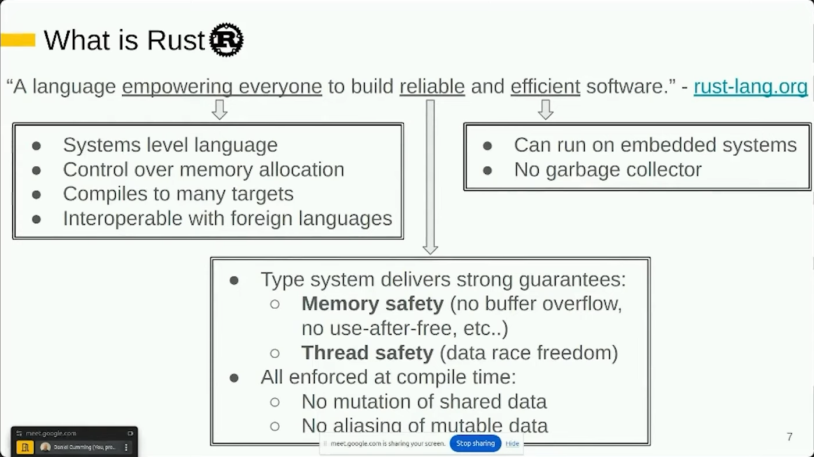
- [05:06](https://youtu.be/Ju7v6vgfEt8?t=306)  The borrowing mechanism ensures shared data cannot be mutated while multiple references exist, maintaining integrity.

## Use of Unsafe Code
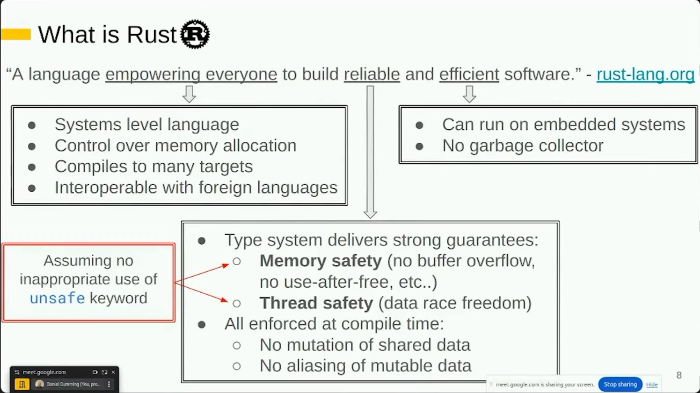
- [05:39](https://youtu.be/Ju7v6vgfEt8?t=339)  While memory safety relies on proper usage of safe constructs, misuse of the `unsafe` keyword allows direct manipulation but risks introducing bugs.

## Standard Library Utilization
- [06:36](https://youtu.be/Ju7v6vgfEt8?t=396)  The standard library provides safe abstractions over unsafe code (e.g., vectors), allowing developers to manage concurrency safely while leveraging powerful features.
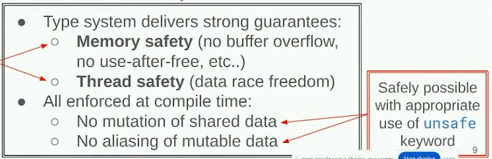

# [07:14](https://youtu.be/Ju7v6vgfEt8?t=434)  Exploring the Rust Compiler

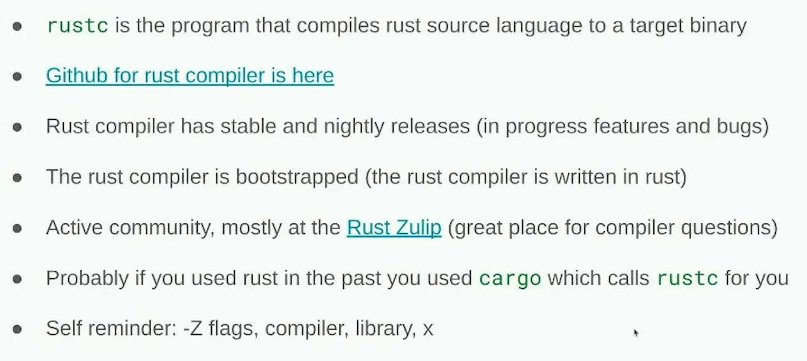

## Introduction to rustc
- [07:14](https://youtu.be/Ju7v6vgfEt8?t=434)  Daniel transitions to discussing `rustc`, which compiles Rust source code into target binaries.

# [07:46](https://youtu.be/Ju7v6vgfEt8?t=466)  Understanding the Rust Compiler and Its Components

## Overview of the Source Directory and Compiler
- [07:46](https://youtu.be/Ju7v6vgfEt8?t=466)  The source directory is not central to today's discussion; focus will be on documentation, compiler, and library.
- [08:10](https://youtu.be/Ju7v6vgfEt8?t=490)  Cloning the compiler repository allows building a fourth directory called "build," which contains the Rust C binary. Building takes significant time and space.
- [08:33](https://youtu.be/Ju7v6vgfEt8?t=513)  To build, users must utilize specific scripts (X scripts), particularly x.p for configuration purposes.

## Bootstrapping in Rust
- [08:55](https://youtu.be/Ju7v6vgfEt8?t=535)  The Rust compiler is a bootstrap compiler; its code is written in Rust itself, showcasing clever design principles.
- [09:28](https://youtu.be/Ju7v6vgfEt8?t=568)  Inside the compiler directory are numerous crates responsible for translating source language into binary while performing various analyses.

## Compiler Frameworks and Languages
- [10:02](https://youtu.be/Ju7v6vgfEt8?t=602)  Compilers can be built using external languages; frameworks like Java Cup and Flex YYC exist for defining grammars dynamically.
- [10:38](https://youtu.be/Ju7v6vgfEt8?t=638)  There are multiple bootstrap compilers available, each with unique benefits in compiling Rust into binaries.

## Cargo Tooling in Rust
- [11:15](https://youtu.be/Ju7v6vgfEt8?t=675)  Users familiar with Rust may have used Cargo, which simplifies interactions with the Rust compiler by running `rustc` under the hood.
- [11:39](https://youtu.be/Ju7v6vgfEt8?t=699)  When executing `cargo run`, it automatically handles arguments for `rustc`, streamlining user experience.

## Versions of the Compiler
- [12:13](https://youtu.be/Ju7v6vgfEt8?t=733)  The GitHub repository features nightly builds of the compiler that include frequent updates from community contributions aimed at improving functionality.
- [12:50](https://youtu.be/Ju7v6vgfEt8?t=770)  Stable releases of the compiler are also available, providing more reliability by excluding experimental features.

## Library Directory Insights
- [13:13](https://youtu.be/Ju7v6vgfEt8?t=793)  The library directory contains core primitives essential to Rust, including types related to memory allocation and standard libraries like vectors and slices.
- [13:47](https://youtu.be/Ju7v6vgfEt8?t=827)  Understanding these components is crucial as they support building robust applications within the language framework.

## Community Engagement and Learning Resources
- [14:10]([How the Rust Compiler Works, a Deep Dive - YouTube](https://youtu.be/Ju7v6vgfEt8?t=850))  For those interested in learning more about the Rust compiler or engaging with others, [**Zulip**](https://forge.rust-lang.org/platforms/zulip.html) serves as an excellent platform for questions and discussions.

## Compilation Process Breakdown

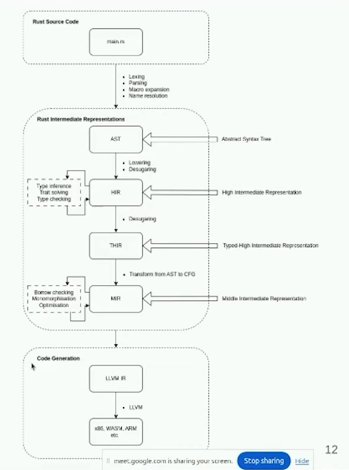

- [14:50](https://youtu.be/Ju7v6vgfEt8?t=890)  The process of converting source code to binary can be divided into **three main stages**:
  1. Source Code Level
  2. Intermediate Representation Level
  3. Code Generation Stage

# [15:35](https://youtu.be/Ju7v6vgfEt8?t=935)  Understanding Rust Compilation Process

## Overview of Code Transformation

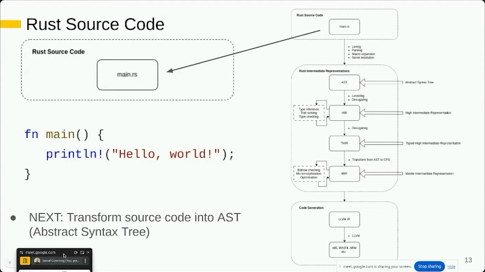

- [15:35](https://youtu.be/Ju7v6vgfEt8?t=935)  The process of transforming code into the desired format involves multiple rounds of analysis to ensure it conforms to the language's specifications.
- [15:57](https://youtu.be/Ju7v6vgfEt8?t=957)  A simple "Hello World" program in Rust serves as a motivating example for understanding these transformations.

## Lexing and Parsing

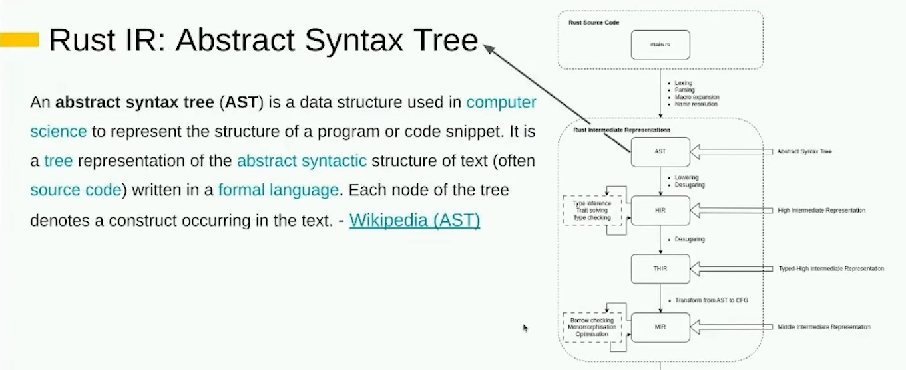

- [16:29](https://youtu.be/Ju7v6vgfEt8?t=989)  An **Abstract Syntax Tree (AST)** is created from source code, which requires two main processes: **lexing** and **parsing**.
- [17:05](https://youtu.be/Ju7v6vgfEt8?t=1025)  Lexing involves reading a stream of characters and recognizing tokens that match the language's syntax, such as function definitions.

## Abstract Syntax Tree Representation
- [17:29]([How the Rust Compiler Works, a Deep Dive - YouTube](https://youtu.be/Ju7v6vgfEt8?t=1049))  The [**AST**](https://en.wikipedia.org/wiki/Abstract_syntax_tree) visually represents a program in a tree structure, useful for compilers. It includes various statements like conditions and assignments.

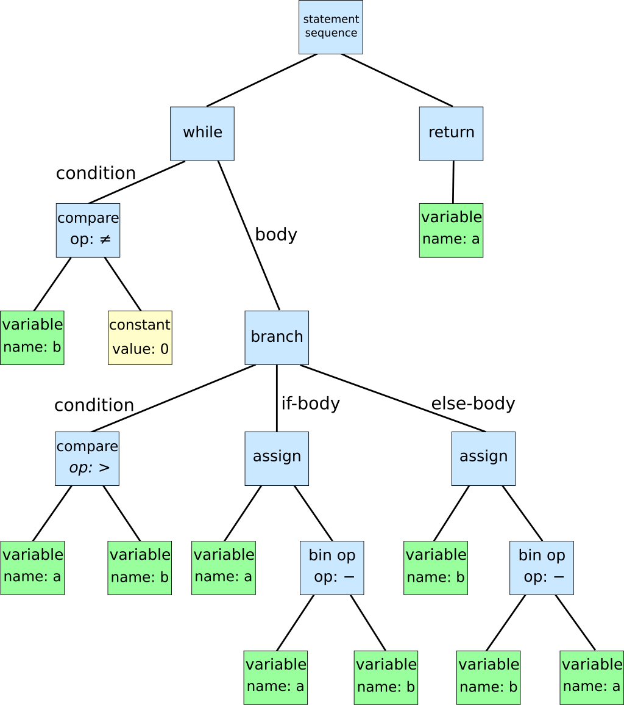

- [17:52](https://youtu.be/Ju7v6vgfEt8?t=1072)  The initial step for the Rust compiler is to create this AST through lexing and parsing before further processing.

## Macro Expansion and Name Resolution
- [18:50](https://youtu.be/Ju7v6vgfEt8?t=1130)  After creating the AST, the compiler must expand macros and resolve names to fully understand the program structure.
- [19:13](https://youtu.be/Ju7v6vgfEt8?t=1153)  Commands can be run in Rust C using specific flags (e.g., -Z help), allowing users to view different states within the compiler during this process. `rustc -Z unpretty="ast-free" src/main.rs`

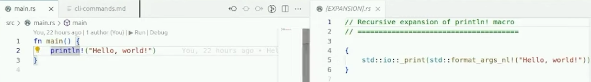

## Viewing Compiler Output
- [19:47](https://youtu.be/Ju7v6vgfEt8?t=1187)  By utilizing commands like `rustc -Z help`, users can access various compiler flags that provide insights into its operations.
- [20:57](https://youtu.be/Ju7v6vgfEt8?t=1257)  The output of an AST does not resemble traditional graphical representations but instead appears as nodes with pointers indicating relationships between them.

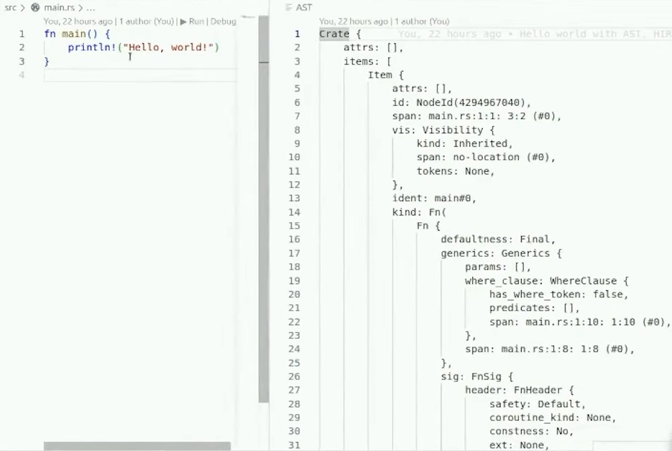

## Practical Tools for Rust Development
- [21:52]([How the Rust Compiler Works, a Deep Dive - YouTube](https://youtu.be/Ju7v6vgfEt8?t=1312))  The [**Rust Analyzer**](https://marketplace.visualstudio.com/items?itemName=rust-lang.rust-analyzer) is highly recommended for developers; it provides extensive information about code within IDE environments, enhancing productivity.

# [23:35](https://youtu.be/Ju7v6vgfEt8?t=1415)  Understanding the Role of Intermediate Representations in Rust Compilers

## The Purpose of Intermediate Representations
- [23:35](https://youtu.be/Ju7v6vgfEt8?t=1415)  The discussion begins with a question about the utility of seeing the intermediate representations (IR) of a program, primarily aimed at those interested in compilers.
- [23:59](https://youtu.be/Ju7v6vgfEt8?t=1439)  While IR is crucial for compiler developers, it also serves others who need to understand runtime verification and build tooling like theorem proving and interpreters for Rust.
- [24:35](https://youtu.be/Ju7v6vgfEt8?t=1475)  Many programs utilize IR from the Rust compiler for various business cases, although most users are typically compiler enthusiasts.

## Relationship Between Macros and Intermediate Representations
- [25:07](https://youtu.be/Ju7v6vgfEt8?t=1507)  A question arises regarding the relationship between macros in Rust and their representation; it's noted that there is indeed a connection.
- [25:28](https://youtu.be/Ju7v6vgfEt8?t=1528)  The existence of an intermediate representation depends on macros, which can be expanded into larger structures during compilation.
- [26:14](https://youtu.be/Ju7v6vgfEt8?t=1574)  When creating procedural macros in Rust, developers must consider lexing and parsing tokens, indicating a deeper level of complexity involved.

## Analyzing Abstract Syntax Trees
- [26:38](https://youtu.be/Ju7v6vgfEt8?t=1598)  The abstract syntax tree (AST) is introduced as a tool for debugging complex programs by revealing what gets outputted by the compiler.
- [27:00](https://youtu.be/Ju7v6vgfEt8?t=1620)  Transforming AST into **high-level intermediate representation** involves lowering and desugaring features to streamline control flow constructs like loops into singular representations.

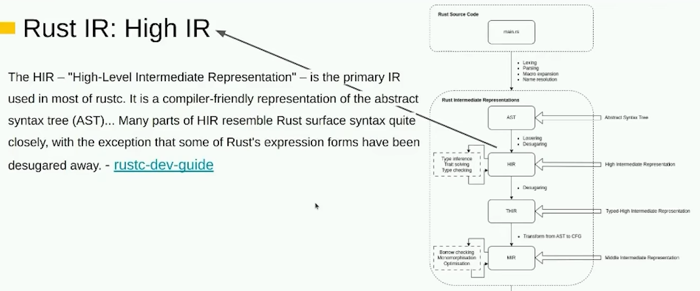

## Lowering and Desugaring Process

- [27:24](https://youtu.be/Ju7v6vgfEt8?t=1644)  Features such as `for` loops, `while` loops, and infinite loops are consolidated into **one loop keyword** to simplify analysis.
- [28:18](https://youtu.be/Ju7v6vgfEt8?t=1698)  This process leads to transforming multiple control flow statements into match statements for easier handling within the compiler's analysis phase.

## Type Safety Guarantees in Rust Compilation

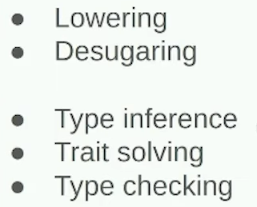

- [28:52](https://youtu.be/Ju7v6vgfEt8?t=1732)  After **lowering**, type inference, trait solving, and type checking occur within this new representation to ensure type safety guarantees provided by the Rust compiler.
- [29:32](https://youtu.be/Ju7v6vgfEt8?t=1772)  The transition from surface language to high-level IR shows added details like prelude inclusions and macro expansions that enhance clarity for further analysis.

`rustc -Z unpretty="hir" src/main.rs`
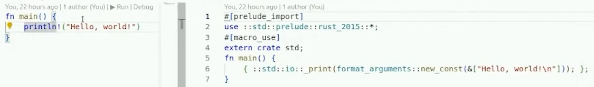

`rustc -Z unpretty="hir-tree" src/main.rs`
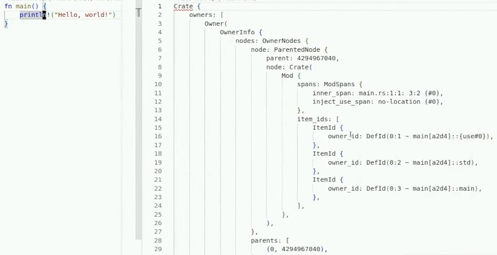

## Allocation IDs in Compiler Analysis
- [30:04](https://youtu.be/Ju7v6vgfEt8?t=1804)  In this stage of compilation, every expression receives **unique identifiers** known as `DefId` essential for tracking elements throughout various analysis rounds.


# Understanding Rust Compiler Analysis Techniques

## Overview of Analysis Techniques
- [31:30](https://youtu.be/Ju7v6vgfEt8?t=1890)  The analysis techniques at the high-level include **trait solving**, **type inference**, and **type checking**. These processes are essential for understanding how Rust handles types and generics during compilation.

## Type Inference in Rust

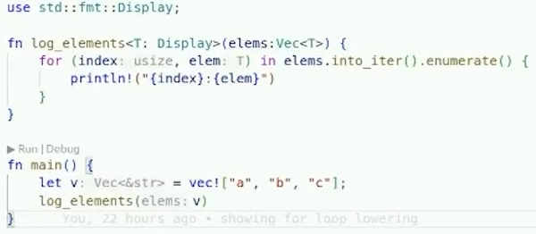

- [32:14](https://youtu.be/Ju7v6vgfEt8?t=1934)  **Type inference** allows the Rust compiler to deduce types without explicit declarations. For example, it can identify a variable as a vector of strings based on context.

## Trait Solving Explained
- [32:38](https://youtu.be/Ju7v6vgfEt8?t=1958)  Trait solving involves determining if generics used in functions can be instantiated correctly. The compiler checks if the generic types meet required traits, such as implementing `Display` for printing elements.
- [33:13](https://youtu.be/Ju7v6vgfEt8?t=1993)  An example is provided where a function logs elements from a vector of type `T`, which must implement the `Display` trait to ensure **proper output formatting**.

## Importance of Type Checking
- [34:11](https://youtu.be/Ju7v6vgfEt8?t=2051)  Type checking ensures that variables conform to their defined types, preventing errors like assigning negative numbers to unsigned integers (`u32`). This process is more complex than simply verifying basic constraints.

## Transitioning to Intermediate Representation (IR)


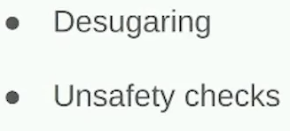

- [35:03](https://youtu.be/Ju7v6vgfEt8?t=2103)  After initial analysis, the representation evolves into an intermediate representation (IR), which retains more detailed information necessary for further analysis.
- [35:48](https://youtu.be/Ju7v6vgfEt8?t=2148)  The IR is fully type checked and elaborated, allowing for deeper safety checks related to unsafe code usage within Rust programs.

`rustc -Z unpretty="thir-tree" src/main.rs`
`rustc -Z unpretty="thir-flat" src/main.rs`

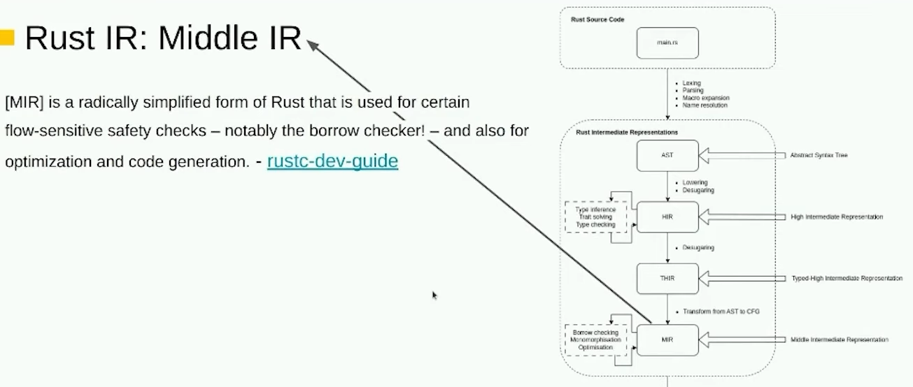

## Control Flow Graph (CFG)

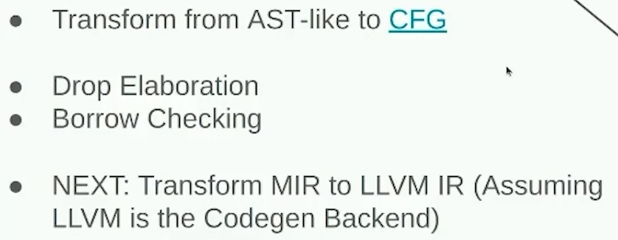

# [40:05](https://youtu.be/Ju7v6vgfEt8?t=2405)  Understanding Control Flow Graphs in Rust

## Overview of Memory Representation

- [40:05](https://youtu.be/Ju7v6vgfEt8?t=2405)  The **Mir (Middle IR)** level involves declaring memory locations that will eventually be assigned types, forming the basis for program execution within nodes of a [**control flow graph (CFG)**](https://en.wikipedia.org/wiki/Control-flow_graph).

## Structure of Control Flow Graph (CFG)

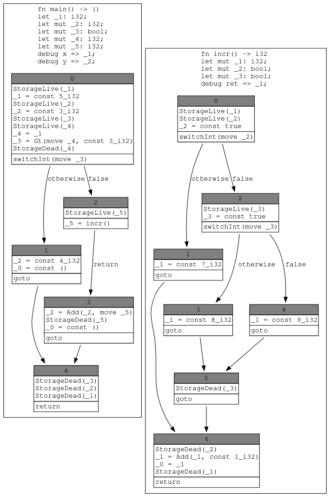

- [40:27](https://youtu.be/Ju7v6vgfEt8?t=2427)  CFG consists of **basic blocks** where each block contains statements performing assignments to memory locations, culminating in a terminator that decides branching based on an integer value.
- [40:51](https://youtu.be/Ju7v6vgfEt8?t=2451)  Basic Block 1 includes two assignment statements and has a direct edge to Basic Block 4, which concludes with return statements.

## Looping and Analysis Benefits
- [41:14](https://youtu.be/Ju7v6vgfEt8?t=2474)  CFG can include loops; for instance, it is valid for Basic Block 2 to branch back to Basic Block 1.
- [41:14](https://youtu.be/Ju7v6vgfEt8?t=2474) This structure aids in subsequent analysis rounds.
- [41:48](https://youtu.be/Ju7v6vgfEt8?t=2508)  The analysis at this level focuses on **Drop Elaboration** and **Borrow Checking**, crucial for enforcing Rust's memory safety guarantees regarding lifetimes and allocation.

## Visualizing MIR Representations
- [42:09](https://youtu.be/Ju7v6vgfEt8?t=2529)  Using tools like `unpretty=mir` allows visualization of the MIR representation alongside source code, providing insights into memory declarations without taking them too literally.

  `rustc -Z unpretty="mir" src/main.rs`

  `rustc -Z unpretty="mir" -Zmir-enable-passes=-PromoteTemps src/main.rs`
  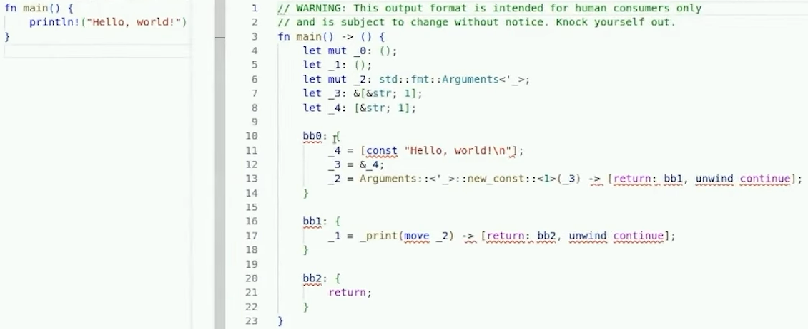

- [43:29](https://youtu.be/Ju7v6vgfEt8?t=2609)  In MIR, **variables are replaced by memory places with specific types**; Place Zero is reserved for function returns while others act as registers or memory locations.

## Execution Flow in MIR Programs
- [44:03](https://youtu.be/Ju7v6vgfEt8?t=2643)  The execution starts from Basic Block Zero, assigning "Hello World" to Place Four and creating a non-mutable reference. If successful, it branches to Basic Block One.
- [44:39](https://youtu.be/Ju7v6vgfEt8?t=2679)  In Basic Block One, the output from printing is assigned to Place One. If no errors occur during this process, it transitions through the terminator to Basic Block Two.

# [45:11](https://youtu.be/Ju7v6vgfEt8?t=2711)  Transitioning from MIR to Code Generation

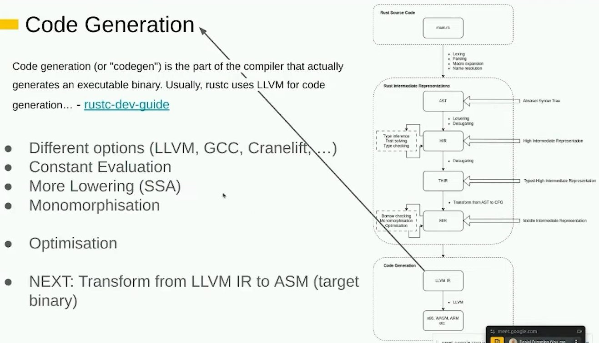

## Final Steps Before Code Generation
- [45:47](https://youtu.be/Ju7v6vgfEt8?t=2747)  After completing analyses in MIR, the next step involves transitioning towards **code generation using LLVM** or other backends like GCC or custom solutions tailored for specific use cases.

## Importance of Constant Evaluation
- [46:22](https://youtu.be/Ju7v6vgfEt8?t=2782)  Prior to code generation, all constants within Rust programs undergo evaluation. This ensures that constant values are resolved before further processing occurs.

## Lowering Process Explained

[**Static single-assignment form (SSA)**](https://en.wikipedia.org/wiki/Static_single-assignment_form)

# [47:39](https://youtu.be/Ju7v6vgfEt8?t=2859)  Understanding Monomorphization in Rust

## The Role of Monomorphization
- [47:39](https://youtu.be/Ju7v6vgfEt8?t=2859)  In Rust, generics allow functions to handle multiple types, but binaries do not understand these abstractions. [**Monomorphization**](https://en.wikipedia.org/wiki/Monomorphization) converts generics into specific functions for each type used.
- [48:00](https://youtu.be/Ju7v6vgfEt8?t=2880)  The process involves creating individual functions during code generation, ensuring that the binary can execute all necessary operations for the generic code.

## Transitioning to LLVM
- [48:32](https://youtu.be/Ju7v6vgfEt8?t=2912)  Once in LLVM (Low-Level Virtual Machine), extensive optimization occurs, bringing the representation closer to a binary format.
- [49:05](https://youtu.be/Ju7v6vgfEt8?t=2945)  Users can view LLVM's output through tools like `llvm BC`, which provides insights into the compiled code structure before reaching the final binary.

  **`rustc --emiy llvm-ir src/main.rs`**
  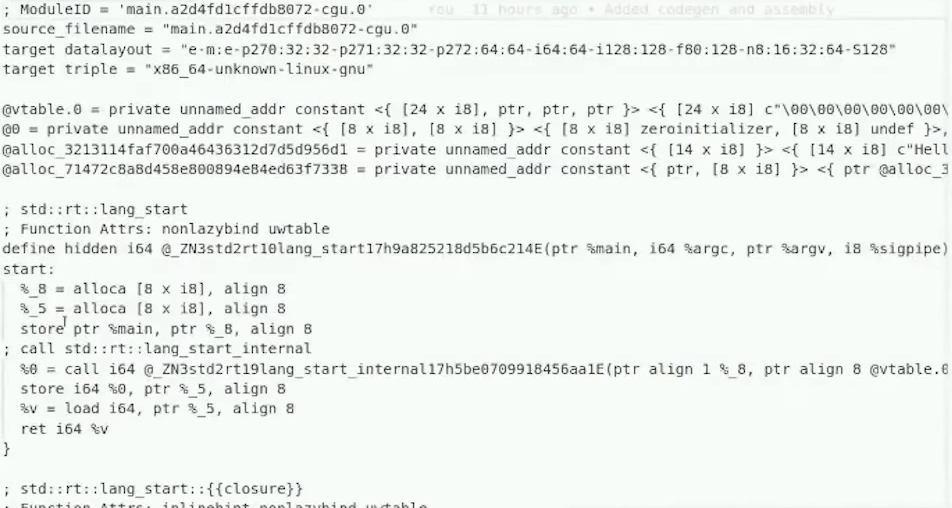

  **`rustc --emiy llvm-bc src/main.rs`**
  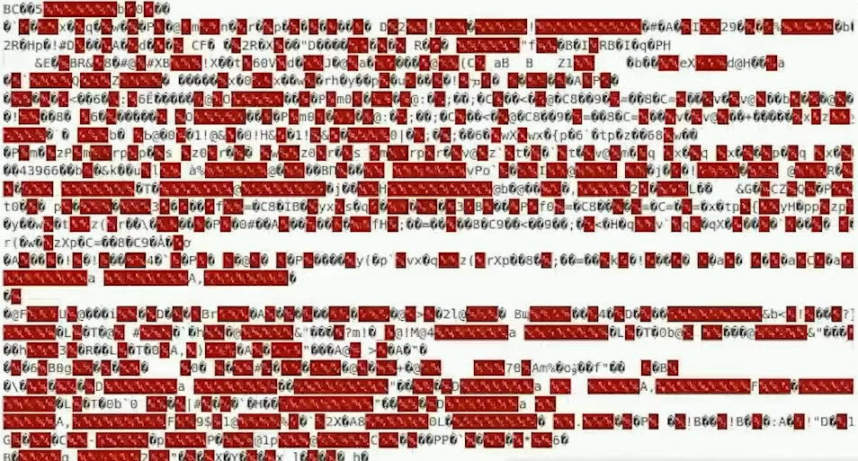

## Compilation Process Overview

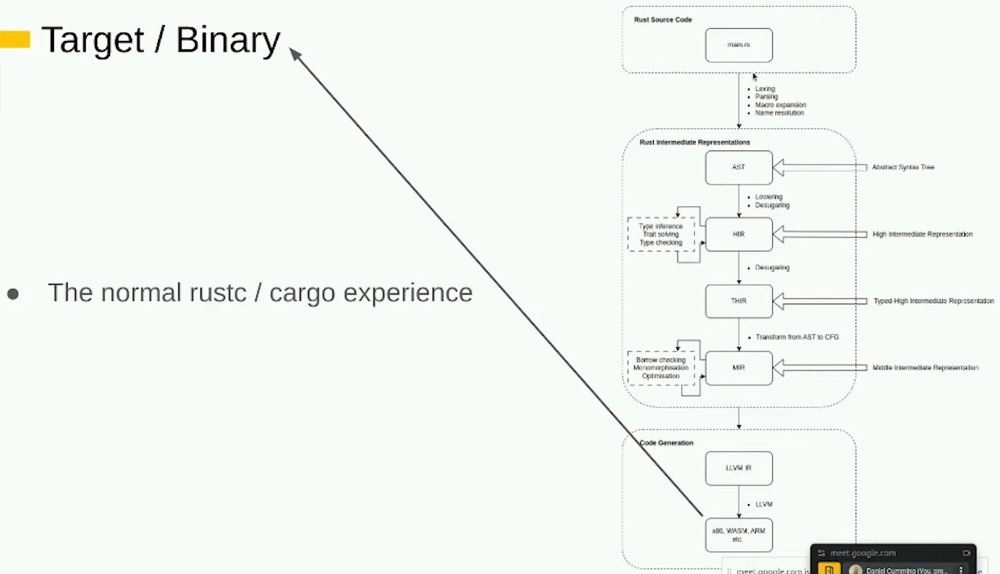

- [49:42](https://youtu.be/Ju7v6vgfEt8?t=2982)  The compilation journey typically starts with writing a Rust source program and using Cargo to build it, resulting in a target binary.
- [50:03](https://youtu.be/Ju7v6vgfEt8?t=3003)  An example provided is an **x86 assembly instruction** set generated from a simple "Hello World" program, illustrating how high-level code translates into lower-level instructions.

  **`rustc --emiy ASM src/main.rs`**
  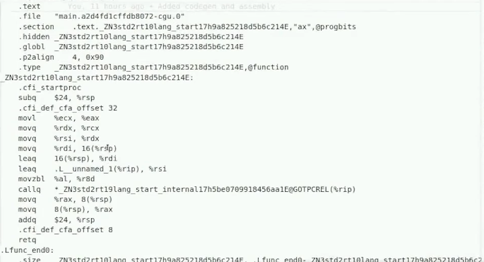

# [51:03](https://youtu.be/Ju7v6vgfEt8?t=3063)  Exploring Intermediate Representations

## Interaction and Further Learning
- [51:03](https://youtu.be/Ju7v6vgfEt8?t=3063)  A suggestion was made to collect emails for further discussions on **intermediate representations (IR)**, indicating interest in deeper engagement with participants.

## Abstract Syntax Tree (AST)
- [51:24](https://youtu.be/Ju7v6vgfEt8?t=3084)  The abstract syntax tree represents the structure of source programs in Rust. It captures function definitions and validates syntax rules during parsing.
- [51:56](https://youtu.be/Ju7v6vgfEt8?t=3116)  **ABI (Application Binary Interface)** relates more closely to compiled bytecode than AST; it defines how different components interact at runtime.

## Code Generation Insights
- [52:19](https://youtu.be/Ju7v6vgfEt8?t=3139)  **The Rust compiler does not generate binary code directly; this task falls under LLVM or other backends like GCC**. This separation emphasizes modularity within compilers.
- [52:56](https://youtu.be/Ju7v6vgfEt8?t=3176)  Code generation is crucial as it determines how high-level constructs translate into machine-specific instructions based on chosen targets like **x86** or **ARM**.

# [53:21](https://youtu.be/Ju7v6vgfEt8?t=3201)  Intermediate Representations and Their Importance

## Understanding IR Structures
- [53:21](https://youtu.be/Ju7v6vgfEt8?t=3201)  Different IR stages exist within the Rust environment, facilitating various analyses and transformations before reaching final executable form.

## Lexical Analysis and Parsing

# [55:35](https://youtu.be/Ju7v6vgfEt8?t=3335)  Understanding Rust's Compilation Process

## Overview of Intermediate Representations (IR)
- [55:35](https://youtu.be/Ju7v6vgfEt8?t=3335)  The compilation process begins with expanding macros to fully elaborate names, leading down to the crate root. This sets the stage for further analysis.
- [56:08](https://youtu.be/Ju7v6vgfEt8?t=3368)  The first pass of guarantees involves type checking, where the compiler infers types not explicitly defined and checks trait bounds for instantiation feasibility.
- [56:30](https://youtu.be/Ju7v6vgfEt8?t=3390)  After type checking, a desugaring process occurs, resulting in a typed High Intermediate Representation (HIR), which includes checks for unsafety.

## Transitioning to Middle Intermediate Representation (MIR)
- [56:54](https://youtu.be/Ju7v6vgfEt8?t=3414)  The transition from an abstract syntax tree to a control flow graph marks the next phase. This graph consists of basic blocks containing statements that reference memory locations rather than variables.
- [57:18](https://youtu.be/Ju7v6vgfEt8?t=3438)  Each basic block concludes with a terminator that can branch out to other blocks, creating a structured layout of program execution paths.
- [57:41](https://youtu.be/Ju7v6vgfEt8?t=3461)  MIR is crucial for analyzing borrowing and lifetimes, ensuring shared data remains unmutated while managing multiple references effectively.

## Code Generation and Final Steps
- [58:14](https://youtu.be/Ju7v6vgfEt8?t=3494)  Following MIR analysis, code generation requires evaluating constants and processing generics into concrete instantiations before reaching the final representation.
- [58:37](https://youtu.be/Ju7v6vgfEt8?t=3517)  The output can be directed towards various code generation backends like LLVM; however, this step ultimately leads to producing the target binary.

## Enhancing Compilation Insights
- [59:12](https://youtu.be/Ju7v6vgfEt8?t=3552)  Typically overlooked steps in compilation are examined here; understanding these processes enriches knowledge about how binaries are built from source code.
- [59:35](https://youtu.be/Ju7v6vgfEt8?t=3575)  A proposal is made to improve visibility into IR by allowing inspection during runtime instead of just at compile time through pretty printed representations.

## Utilizing Rust Compiler Internally

  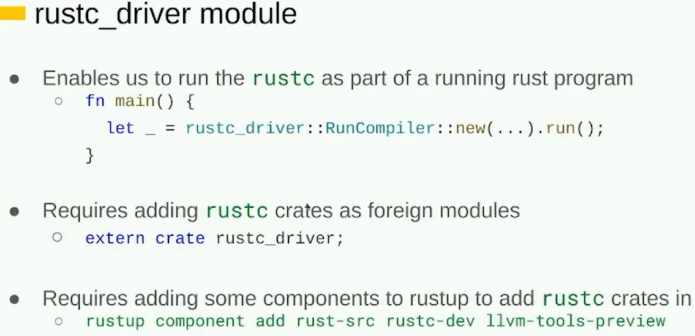

- [01:00:18](https://youtu.be/Ju7v6vgfEt8?t=3618)  Rust enables calling its own compiler via an internal crate called **"rustc driver"** facilitating nested compilation within Rust programs.
- [01:00:41](https://youtu.be/Ju7v6vgfEt8?t=3641)  A pseudo-code example illustrates how one might create an instance of the compiler within their main function using this driver module.

## Practical Implementation Steps
- [01:01:27](https://youtu.be/Ju7v6vgfEt8?t=3687)  To implement nested compilation successfully, developers must include `extern crate rustc_driver` in their program along with specific feature flags for proper functionality.

# [01:02:23](https://youtu.be/Ju7v6vgfEt8?t=3743)  Installation and Setup of rustc Driver

## Overview of Required Components
- [01:02:23](https://youtu.be/Ju7v6vgfEt8?t=3743)  The command line indicates the need to install additional components for the task at hand, specifically related to the Rust crate. `rustup component add rust-src rustc-dev llvm-tools-preview`
- [01:02:56](https://youtu.be/Ju7v6vgfEt8?t=3776)  Two main crates are highlighted: `rustc_driver` and `rustc_driver_impl`, which contain essential code for leveraging nested calls in the compiler.

## Minimum Example for Running the Compiler
- [01:03:27](https://youtu.be/Ju7v6vgfEt8?t=3807)  A minimum example is presented for running the compiler, with a suggestion to increase font size for better visibility during demonstration.
  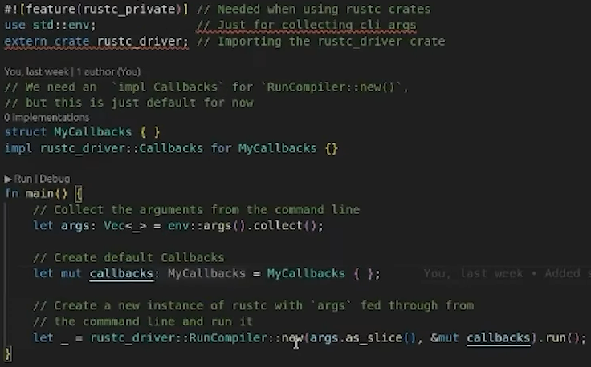
- [01:03:50](https://youtu.be/Ju7v6vgfEt8?t=3830)  The source directory contains only a `main.rs` file, while an external **"Hello World" program** is referenced but not included in any crates, meaning it won't be part of cargo build processes.
  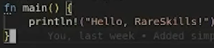

## Command Line Arguments and Callbacks
- [01:04:12](https://youtu.be/Ju7v6vgfEt8?t=3852)  The example focuses on using the driver without interrupting callbacks; instead, it runs the compiler directly from a compiled program.
- [01:04:56](https://youtu.be/Ju7v6vgfEt8?t=3896)  An empty struct called `callback` is created to implement necessary traits without overriding functions, allowing default behavior that simply passes through to the compiler.

## Building and Running Programs
- [01:05:43](https://youtu.be/Ju7v6vgfEt8?t=3943)  The process begins with building the main program using `cargo build`, resulting in a binary that can call the Rust compiler.
- [01:06:15](https://youtu.be/Ju7v6vgfEt8?t=3975)  When running this binary with arguments pointing to "hello.rs" (`cargo run -- ~/presentation/hello.rs`), it should compile successfully and output **"Hello Rare Skills"**.

## Understanding Compiler Callbacks
- [01:06:51](https://youtu.be/Ju7v6vgfEt8?t=4011)  If no input is provided when calling Rust C, an error message appears indicating incorrect usage; however, providing valid arguments leads to successful compilation.
- [01:07:15](https://youtu.be/Ju7v6vgfEt8?t=4035)  After confirming successful execution of a simple program, attention shifts towards examining callback traits within the Rust compiler's implementation.

# [01:07:40](https://youtu.be/Ju7v6vgfEt8?t=4060)  Exploring Callback Traits in Rust Compiler

## Key Functions within Callback Trait
- [01:08:17](https://youtu.be/Ju7v6vgfEt8?t=4097)  The discussion introduces key functions within the callback trait such as `after_create_root_passing`, which allows custom code insertion during compilation phases.

## Queries System Explanation
- [01:08:40](https://youtu.be/Ju7v6vgfEt8?t=4120)  It’s noted that some functions may be deprecated but still functional. Custom code can manipulate queries during different stages of compilation (e.g., after macro expansion).

## Clarification on Queries
- [01:09:14](https://youtu.be/Ju7v6vgfEt8?t=4154)  A request for clarification on queries leads to an explanation that they serve as a system within the Rust compiler for retrieving information at various points during compilation.

## Typing Context Manipulation

# [01:10:05](https://youtu.be/Ju7v6vgfEt8?t=4205)  Understanding Rust Compiler Queries

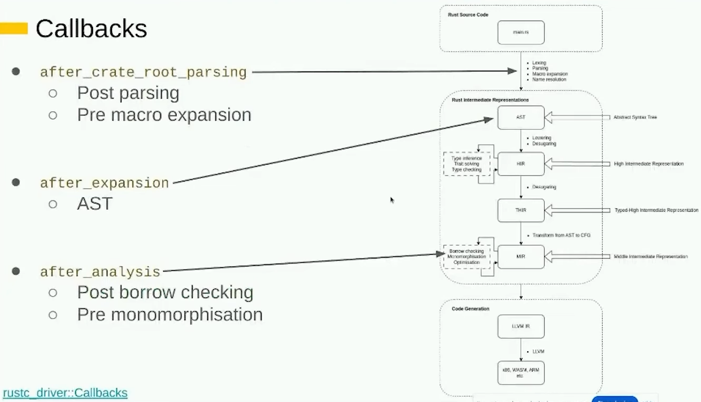

## Overview of Compiler Queries
- [01:10:05](https://youtu.be/Ju7v6vgfEt8?t=4205)  The speaker introduces **compiler queries**, explaining that they allow for feeding information through the Rust compiler at specific points of interest during compilation.
- [01:10:39](https://youtu.be/Ju7v6vgfEt8?t=4239)  **Three key points** in the compilation process are identified where analysis can be interrupted:
  1. after crate root parsing: `after_crate_root_parsing`
  2. after macro expansion and name resolution: `after_expansion`
  3. and after full analysis: `after_analysis`

## Compilation Phases
- [01:11:01](https://youtu.be/Ju7v6vgfEt8?t=4261)  The first phase occurs post-abstract syntax tree (AST) creation, where macros remain unexpanded. No analysis is performed at this stage.
- [01:11:37](https://youtu.be/Ju7v6vgfEt8?t=4297)  The second phase involves analyzing the AST after macro expansion but before type checking and trait solving. Programs with borrow checker violations can still be analyzed here without errors.

## Practical Example of Callbacks

  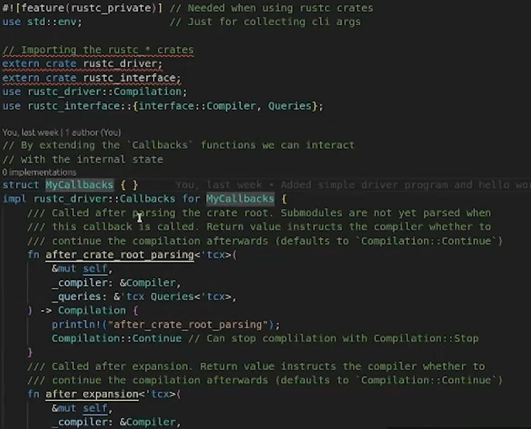

- [01:12:01](https://youtu.be/Ju7v6vgfEt8?t=4321)  The speaker demonstrates adding **custom code to callbacks** within the compilation phases, showing how to print messages indicating which phase is currently being executed.
  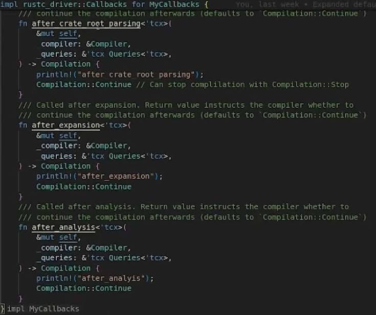
- [01:12:43](https://youtu.be/Ju7v6vgfEt8?t=4363)  By running the compiler multiple times, it becomes evident that stopping at different phases affects whether a binary is created or not.

  **`cargo run -- ~/presentation/hello.rs`**
  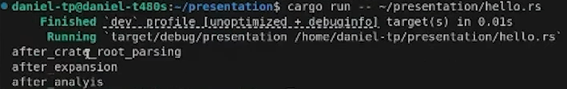

## Error Handling in Compilation
- [01:13:45](https://youtu.be/Ju7v6vgfEt8?t=4425)  If compilation is stopped after macro expansion but before analysis, illegal Rust programs can still produce an AST without throwing errors.
- [01:14:23](https://youtu.be/Ju7v6vgfEt8?t=4463)  An example illustrates that if a variable isn't flagged as mutable and an attempt to reassign it occurs, no error will be thrown until reaching the analysis phase.

## Insights on Syntax Validity
- [01:15:00](https://youtu.be/Ju7v6vgfEt8?t=4500)  The discussion highlights that even syntactically incorrect programs may pass initial checks without triggering immediate errors due to halted analysis.
- [01:16:20](https://youtu.be/Ju7v6vgfEt8?t=4580)  A further exploration into creating invalid syntax reveals that certain constructs can still generate an AST despite being semantically incorrect.

# [01:18:12](https://youtu.be/Ju7v6vgfEt8?t=4692)  Error Handling and Compiler Insights

## Understanding Error Reporting in Compilation
- [01:18:12](https://youtu.be/Ju7v6vgfEt8?t=4692)  The program's error handling system is designed to collect comprehensive information about errors rather than stopping at the first encountered issue, allowing for richer debugging insights.
- [01:18:33](https://youtu.be/Ju7v6vgfEt8?t=4713)  The compiler continues processing even after encountering an error, aiming to provide as much context as possible for troubleshooting.

## Macro Expansion and Error Detection
- [01:18:56](https://youtu.be/Ju7v6vgfEt8?t=4736)  Discusses the implications of introducing a non-existent macro during the expansion phase, highlighting how errors can be detected before full expansion occurs.
- [01:19:32](https://youtu.be/Ju7v6vgfEt8?t=4772)  Emphasizes that error messages are streamed directly from the compiler without delay, ensuring immediate feedback on issues.

## Analyzing Compiler Behavior
- [01:19:54](https://youtu.be/Ju7v6vgfEt8?t=4794)  Transitioning to a more complex example with additional crates allows for deeper exploration of compiler behavior post-analysis phase.
- [01:20:29](https://youtu.be/Ju7v6vgfEt8?t=4829)  Introduces querying global context within the Rust compiler, demonstrating how to access mutable references and utilize closures effectively.

# [01:20:52](https://youtu.be/Ju7v6vgfEt8?t=4852)  Exploring Type Context in Rust

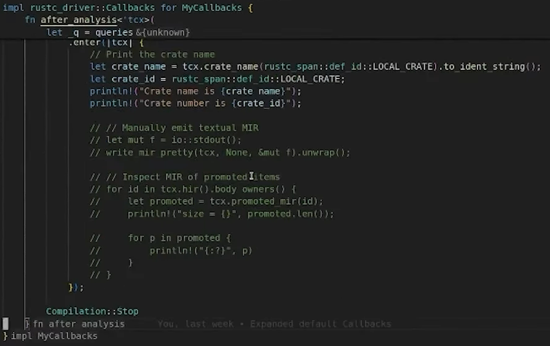

## Accessing Internal Functions
- [01:21:14](https://youtu.be/Ju7v6vgfEt8?t=4874)  Explains how various internal functions can be accessed through the **typing context (tcx)**, enabling extensive manipulation capabilities within the Rust compiler.

## Practical Example: Crate Information Retrieval
- [01:21:48](https://youtu.be/Ju7v6vgfEt8?t=4908)  Demonstrates retrieving crate definitions and names using internal functions, showcasing aspects of Rust's internals typically hidden from users.
- [01:22:20](https://youtu.be/Ju7v6vgfEt8?t=4940)  Highlights that understanding crate identifiers is crucial for navigating multiple crates within a project.

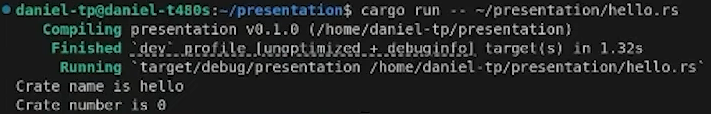

# [01:23:31](https://youtu.be/Ju7v6vgfEt8?t=5011)  Utilizing CLI Commands for Code Analysis

## Pretty Printing with rustc
- [01:23:31](https://youtu.be/Ju7v6vgfEt8?t=5011)  Discusses using CLI commands like   `rustc -Z unpretty="mir" src/main.rs` to generate human-readable representations of code structures such as MIR (Mid-level Intermediate Representation).

  **`rustc -Z unpretty="mir" src/main.rs`**
  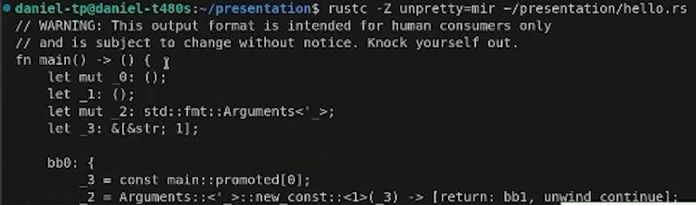

## Internal Function Calls for Enhanced Output
- [01:24:13](https://youtu.be/Ju7v6vgfEt8?t=5053)  Describes accessing internal pretty-printing functions directly via typing context handles, illustrating how developers can leverage existing tools within the Rust ecosystem.
  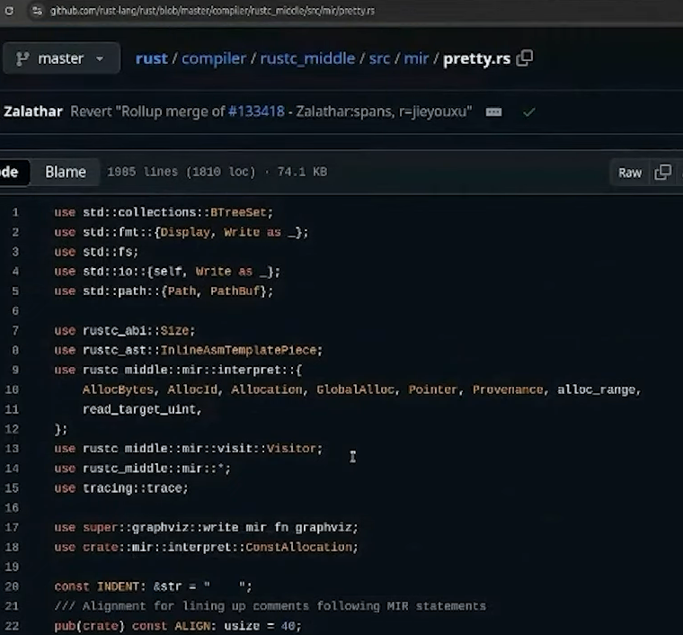
  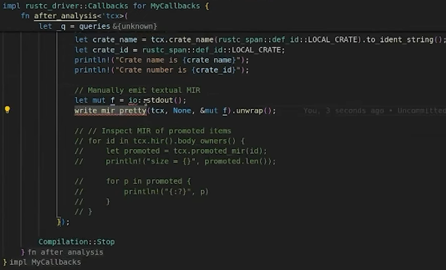
  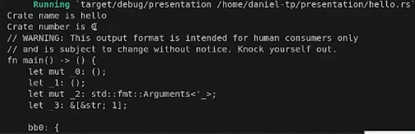

# Understanding Promoted Types in Rust Compiler

## Exploring Promoted Functions

  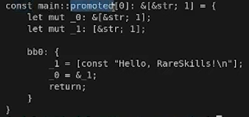

- [01:26:28](https://youtu.be/Ju7v6vgfEt8?t=5188)  The speaker investigates the concept of **"promoted" types** by searching for related functions in the Rust compiler, specifically focusing on a function named `promoted_mir`.
  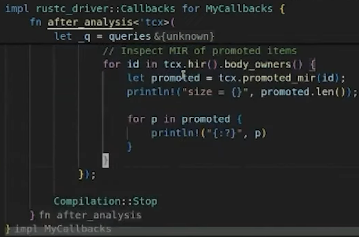
- [01:27:02](https://youtu.be/Ju7v6vgfEt8?t=5222)  They explain that every body within the context has a **definition ID (DefId)**, and they plan to iterate through these bodies to identify promoters and print their sizes.
  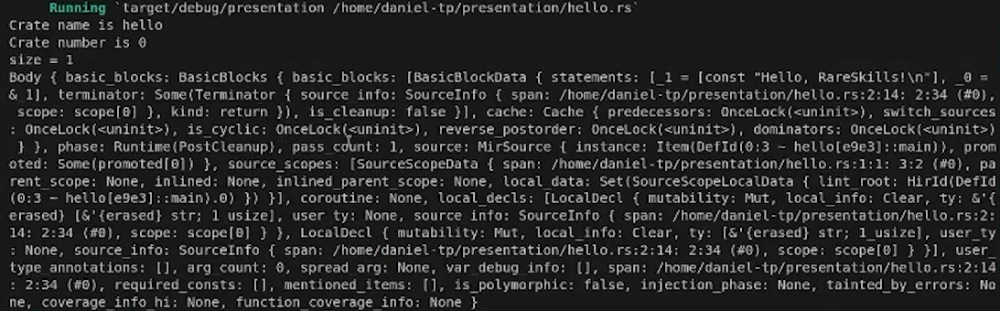

## Analyzing Internal Representations
- [01:27:39](https://youtu.be/Ju7v6vgfEt8?t=5259)  Upon running their analysis, they receive warnings but successfully output internal representations of promoted types, contrasting this with a more user-friendly printed version.
- [01:28:12](https://youtu.be/Ju7v6vgfEt8?t=5292)  The speaker notes that while there may be multiple promoted items, only one is present in this case, confirming expectations through length checks.

## Practical Applications of Analysis
- [01:29:19](https://youtu.be/Ju7v6vgfEt8?t=5359)  The discussion shifts to practical applications where runtime verification is necessary; they mention a project requiring JSON serialization of intermediate representation (MIR).
- [01:29:55](https://youtu.be/Ju7v6vgfEt8?t=5395)  They describe using a driver function called `emit_smir` to facilitate this serialization process, highlighting its role in obtaining global context and executing callbacks.
  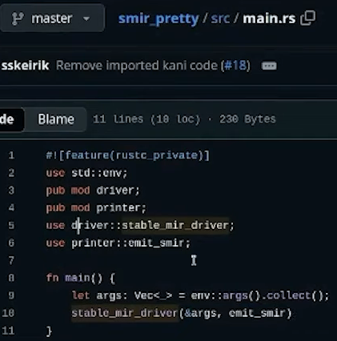

## Serialization Challenges
- [01:30:58](https://youtu.be/Ju7v6vgfEt8?t=5458)  The speaker elaborates on challenges faced during serialization due to the initial format not being ready for direct conversion into JSON.
- [01:31:54](https://youtu.be/Ju7v6vgfEt8?t=5514)  They emphasize the importance of normalizing data forms before serialization and how carrying around typing contexts aids in achieving this goal.

## Custom Code Generation Backends

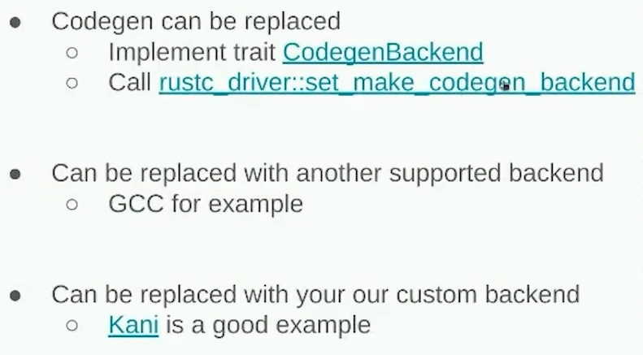

- [01:32:29](https://youtu.be/Ju7v6vgfEt8?t=5549)  Transitioning from interaction with IR levels, they discuss options for custom code generation backends within the Rust compiler beyond default LLVM or GCC options.
- [01:33:08](https://youtu.be/Ju7v6vgfEt8?t=5588)  By implementing the **`CodegenBackend` trait**, developers can create tailored code generation solutions suited for specific use cases like **custom blockchains**.

## Potential Use Cases in Blockchain Development
- [01:34:04](https://youtu.be/Ju7v6vgfEt8?t=5644)  The speaker speculates about **compiling Rust for unique blockchain environments** that require specialized virtual machines (VM), suggesting it’s feasible though not widely reported.

# Understanding Rust Compiler Configuration and Building Process

## Initial Thoughts on M Consumption
- [01:35:00](https://youtu.be/Ju7v6vgfEt8?t=5700) The speaker expresses uncertainty about the consumption of Mir from a stream, noting a lack of serialization encountered. This suggests that there may not be widespread usage in a portable sense.

## Exploring Rust Environment
- [01:35:37](https://youtu.be/Ju7v6vgfEt8?t=5737) Discussion on using **L2 layer blockchain** within the Rust environment indicates potential for direct access to resources, allowing users to write custom Rust programs. However, no concrete answers are provided regarding its feasibility.

## Bounded Model Checking with Coen Backend
- [01:36:00](https://youtu.be/Ju7v6vgfEt8?t=5760) The speaker mentions a project called [**Kani**](https://model-checking.github.io/kani/) (_open-source verification tool that uses [model checking](https://model-checking.github.io/kani/tool-comparison.html) to analyze Rust programs._) that utilizes a paradigm for transferring data necessary for Bounded Model Checking (CBMC). They encourage further exploration into specific traits being overwritten in real-world applications.

## Setting Up rustc for Compiler Work
- [01:36:34](https://youtu.be/Ju7v6vgfEt8?t=5794) Transitioning to **building rustc**, the speaker highlights challenges faced when modifying the compiler and offers tips to ease this process.
- They emphasize the **importance of selecting appropriate build scripts** during setup.

  `./x.py setup`
  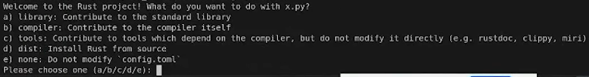
  type **b**

  `time ./x build`

## Build Scripts and Configuration Options
- [01:37:30](https://youtu.be/Ju7v6vgfEt8?t=5850) As they initiate the build process, they explain that choosing specific profiles (like 'compiler') provides configurations tailored for easier modifications while working on the Rust compiler itself. This includes options like debugging settings and incremental compilation enabled by default.

## Understanding Compiler Profiles and Configurations
- [01:39:20](https://youtu.be/Ju7v6vgfEt8?t=5960) The configuration file (`config.example.toml`) is discussed as containing numerous customizable settings essential for building the compiler effectively.
- The speaker notes that defaults are set up by the Rust team to assist newcomers in navigating these options efficiently.

## Stages of Compiler Building Process

# [01:42:48](https://youtu.be/Ju7v6vgfEt8?t=6168)  Rust Compiler Optimization Techniques

## Overview of the rustc Dev Guide
- [01:42:48](https://youtu.be/Ju7v6vgfEt8?t=6168)  The speaker encourages viewers to refer to the [**rustc Dev guide**](https://rustc-dev-guide.rust-lang.org/building/how-to-build-and-run.html), which serves as a comprehensive resource for building and running the Rust compiler.
- [01:42:48](https://youtu.be/Ju7v6vgfEt8?t=6168)  The guide includes [**suggested workflows**](https://rustc-dev-guide.rust-lang.org/building/suggested.html) that streamline processes like profiling, enhancing overall efficiency.

## Improving Compilation Speed
- [01:43:10](https://youtu.be/Ju7v6vgfEt8?t=6190)  Initial compilation times can be lengthy; for example, a first run took 28 minutes of user time.
- [01:43:44](https://youtu.be/Ju7v6vgfEt8?t=6224)  Even with multi-threading capabilities, reducing compile time from 28 minutes to 3 minutes is still not ideal for iterative development.

## Incremental Compilation Strategy
- [01:44:44](https://youtu.be/Ju7v6vgfEt8?t=6284)  After making minor changes in the code (_e.g., modifying a function_), there's no need to rebuild the entire compiler.
- [01:45:29](https://youtu.be/Ju7v6vgfEt8?t=6329)  By using **incremental compilation** and **retaining stage one** components, significant reductions in build times can be achieved.


## Performance Metrics
- [01:46:18](https://youtu.be/Ju7v6vgfEt8?t=6378)  With incremental compilation, build times improved dramatically to 21 seconds of real time and only 1 minute and 20 seconds of user time.
- `./x build --keep-stage 1`
  ```
  real    3m18.777s
  user    27m9.879s
  sys     1m5.075s

  real    0m21.599s
  user    1m19.740s
  sys     0m10.388s
  ```
- [01:46:57](https://youtu.be/Ju7v6vgfEt8?t=6417)  The speaker demonstrates how to locate the compiled binary within the target directory after making changes. `./build/x86_64-unknow-linux-gnu/stage1/bin/rustc -Z unpretty=mir hello.rs`

## Practical Application of Changes
- [01:48:14](https://youtu.be/Ju7v6vgfEt8?t=6494)  A simple change was made in a Rust program (hello.rs), showcasing how modifications are reflected in the output.
- [01:48:48](https://youtu.be/Ju7v6vgfEt8?t=6528)  The speaker emphasizes that even small changes can lead to meaningful improvements in performance metrics.

## Advanced Build Techniques
- [01:49:22](https://youtu.be/Ju7v6vgfEt8?t=6562)  Further optimizations involve specifying **library builds** while maintaining stage one settings for faster results.
- `./x build library --keep-stage 1`
- [01:50:07](https://youtu.be/Ju7v6vgfEt8?t=6607)  Understanding build dependencies is crucial; certain operations must occur sequentially (_e.g., rustdoc after library_).

## Conclusion and Q&A Session
- [01:51:07](https://youtu.be/Ju7v6vgfEt8?t=6667)  The session concludes with an invitation for questions regarding common backend swaps among compilers like **Kany**, **GCC**, and **LLVM**.

# [01:52:05](https://youtu.be/Ju7v6vgfEt8?t=6725)  Compiler Projects and Their Challenges

## Overview of Compiler Projects
- [01:52:05](https://youtu.be/Ju7v6vgfEt8?t=6725)  Discussion on projects like Anas and Caron that focus on exchanging the Coen backend to enhance interactive theorem proving within formal methods.
- [01:52:27](https://youtu.be/Ju7v6vgfEt8?t=6747)  Mention of existing queries in the Rust compiler, highlighting limited options due to predetermined namespaces.

## Namespace Clarifications
- [01:53:03](https://youtu.be/Ju7v6vgfEt8?t=6783)  Explanation of namespace resolution, emphasizing that function names should not conflict with query names during usage.
- [01:53:28](https://youtu.be/Ju7v6vgfEt8?t=6808)  Insight into different Intermediate Representation (IR) layers accessible during compilation, showcasing how they interact throughout the process.

## Internal Compiler Errors
- [01:54:15](https://youtu.be/Ju7v6vgfEt8?t=6855)  Acknowledgment of bugs in compilers, including **rustc** and comparison with other compilers like **Solidity** and **Viper** which also have historical bugs.
- [01:54:47](https://youtu.be/Ju7v6vgfEt8?t=6887)  Definition of an **Internal Compiler Error (ICE)**, characterized by unusual error messages indicating issues within the compiler rather than user code.

## Reporting Bugs
- [01:55:24](https://youtu.be/Ju7v6vgfEt8?t=6924)  Guidance on reporting ICE occurrences to the compiler's GitHub issue board for resolution, stressing the importance of providing context for errors.


---

# Transcription


- [00:00:04](https://www.youtube.com/watch?v=n-ym1utpzhk?t=4) ➜ uh hello everyone my name's uh Daniel I work for runtime verification I am a formal verification engineer there and a lot of what I do is uh
- [00:00:16](https://www.youtube.com/watch?v=n-ym1utpzhk?t=16) ➜ related to rust and the rust compiler uh and so I thought that I'd share at least a cursory overview about that with you here today um a cursory overview that's
- [00:00:28](https://www.youtube.com/watch?v=n-ym1utpzhk?t=28) ➜ going to try to go from start to finish as much as possible I think that is a a somewhat ambitious goal to fit within an hour um there's it's a pretty
- [00:00:40](https://www.youtube.com/watch?v=n-ym1utpzhk?t=40) ➜ complicated piece of software and I guess trying to squeeze uh all of the intro details even inside an hour is a bit like trying to fit a school bus into
- [00:00:49](https://www.youtube.com/watch?v=n-ym1utpzhk?t=49) ➜ a your living room but we'll uh try to make it happen uh can everyone see the screen share can I maybe get some yeah we can see the um
- [00:01:01](https://www.youtube.com/watch?v=n-ym1utpzhk?t=61) ➜ you might have to move your uh what is it called yeah just just move it up into the upper right corner I guess or
- [00:01:06](https://www.youtube.com/watch?v=n-ym1utpzhk?t=66) ➜ something oh this you guys can see the overlay yeah oh nice okay how about that that's probably you won't be able to see any reactions if you put it down there I
- [00:01:15](https://www.youtube.com/watch?v=n-ym1utpzhk?t=75) ➜ don't know wait let me try ah yeah so that yeah so just as an FYI that's okay I I'll fly blind okay um okay so uh some stuff that I'm going to
- [00:01:27](https://www.youtube.com/watch?v=n-ym1utpzhk?t=87) ➜ talk about today is uh a b basic overview of what rust as a language is is trying to do this this is only going to be brief like 3 to 5 minutes just
- [00:01:38](https://www.youtube.com/watch?v=n-ym1utpzhk?t=98) ➜ just talking about uh what the language is which isimportant because uh after that we're going to be talking about the compiler
- [00:01:46](https://www.youtube.com/watch?v=n-ym1utpzhk?t=106) ➜ and the compiler's goal is to take a source programming language that we that we write in Russ Russ source code it's going to turn it into a binary and so uh
- [00:01:56](https://www.youtube.com/watch?v=n-ym1utpzhk?t=116) ➜ it's important to know like what what is it about rust that this compiler has to maintain and and enforce as it goes through these Transitions and so there's
- [00:02:06](https://www.youtube.com/watch?v=n-ym1utpzhk?t=126) ➜ a bunch of things that it's going to need to make sure uh properties that are held by this Source language and um to do that we'll have to do rounds of
- [00:02:14](https://www.youtube.com/watch?v=n-ym1utpzhk?t=134) ➜ analysis and so it's going to transform the language into different intermediate representations uh in order to perform different analysis um uh the best points
- [00:02:26](https://www.youtube.com/watch?v=n-ym1utpzhk?t=146) ➜ in time that it can so so these two points uh here will take a bit of time maybe between 20 and 30 minutes but this is where we're
- [00:02:35](https://www.youtube.com/watch?v=n-ym1utpzhk?t=155) ➜ actually going to be looking inside the Ross compiler uh after that I will talk about um using callbacks which is a more interactive uh way of dealing with the
- [00:02:46](https://www.youtube.com/watch?v=n-ym1utpzhk?t=166) ➜ rust compiler and um these last two points unless uh unless I time travel I don't think I'm going to get to them because I did a bit of a practice run
- [00:02:56](https://www.youtube.com/watch?v=n-ym1utpzhk?t=176) ➜ and I had to strip a bunch of content out of here to even just just make it towards an hour but uh maybe that can be left as a teaser for another
- [00:03:05](https://www.youtube.com/watch?v=n-ym1utpzhk?t=185) ➜ day uh so let's start off what is rust so rust are defined by rust Lang group themselves is a language empowering everyone to build reliable and efficient
- [00:03:17](https://www.youtube.com/watch?v=n-ym1utpzhk?t=197) ➜ software so I think that what they mean by empowering is uh you get a systems level language that gives you explicit control over your memory allocation uh
- [00:03:28](https://www.youtube.com/watch?v=n-ym1utpzhk?t=208) ➜ and it's able to compile to many targets and it's interoperable with other languages through foreign function interface so it's pretty powerful it
- [00:03:36](https://www.youtube.com/watch?v=n-ym1utpzhk?t=216) ➜ does a lot uh and furthermore it's efficient uh this is able to be compiled down small enough to run on embedded systems and it doesn't have a garbage
- [00:03:46](https://www.youtube.com/watch?v=n-ym1utpzhk?t=226) ➜ collector and not having a garbage collector is a little interesting because it is reliable uh without that garbage collector but its type
- [00:03:55](https://www.youtube.com/watch?v=n-ym1utpzhk?t=235) ➜ system um is able to give some strong guarantees of memory safety and thread safety um and by memory safety I mean that uh the typical foot guns that might
- [00:04:12](https://www.youtube.com/watch?v=n-ym1utpzhk?t=252) ➜ be available to you in languages like C where you're able to uh control your own memory allocation like buffer overflow using off free dangling pointers these
- [00:04:24](https://www.youtube.com/watch?v=n-ym1utpzhk?t=264) ➜ are prohibited by the type system so you know if it co- compiles that you're not going to run into that error uh you also know that there's thread
- [00:04:32](https://www.youtube.com/watch?v=n-ym1utpzhk?t=272) ➜ safety in the sense of uh data race Freedom when you do concurrency uh this doesn't prohibit you from I think logically deadlocking a li
- [00:04:45](https://www.youtube.com/watch?v=n-ym1utpzhk?t=285) ➜ blocking your code um in that sense you're thread unsafe but uh you are at least free of data race data races so all of this is enforced at compile time
- [00:04:59](https://www.youtube.com/watch?v=n-ym1utpzhk?t=299) ➜ and um this is done by the fact that rust has borrowing and lifetime semantics so the way that it deals with
- [00:05:09](https://www.youtube.com/watch?v=n-ym1utpzhk?t=309) ➜ references uh that if you have shared data uh so this is multiple borrows multiple references out in the world that you are unable to mutate them so
- [00:05:22](https://www.youtube.com/watch?v=n-ym1utpzhk?t=322) ➜ you know that if you have shared data you can't change the data you also know that if you have mutable data unable to Alias it so you can't make two
- [00:05:31](https://www.youtube.com/watch?v=n-ym1utpzhk?t=331) ➜ references uh to it two mutable borrowers and through uh making sure that these are all enforced at compile time is how they get those strong
- [00:05:41](https://www.youtube.com/watch?v=n-ym1utpzhk?t=341) ➜ guarantees as with anything though there are some caveats so the memory safety and thread safety comes with the assumption that you haven't
- [00:05:49](https://www.youtube.com/watch?v=n-ym1utpzhk?t=349) ➜ inappropriately used the unsafe keyword using the unsafe keyword gives you a lot more power to directly manipulate things like memory and raw pointers uh but it
- [00:06:01](https://www.youtube.com/watch?v=n-ym1utpzhk?t=361) ➜ then uh also empowers you with the foot guns of getting all of the uh memory bugs back in So on the flip side to that you are
- [00:06:13](https://www.youtube.com/watch?v=n-ym1utpzhk?t=373) ➜ also able to safely uh mutate uh shared data and Alias mutable data with the appropriate use of the unsafe keyword so if you use it
- [00:06:25](https://www.youtube.com/watch?v=n-ym1utpzhk?t=385) ➜ appropriately you can do these things and be empowered and so uh a good way to do that would be to use the standard Library which is
- [00:06:33](https://www.youtube.com/watch?v=n-ym1utpzhk?t=393) ➜ essentially wrapping unsafe code to give you things like vectors and uh Atomic references for concurrency so uh there are canonical ways to use unsafe code in
- [00:06:48](https://www.youtube.com/watch?v=n-ym1utpzhk?t=408) ➜ a reasonable way so that's uh that's what's going on with the language of Ross and so now moving on to Ross C Ross C is as I
- [00:06:59](https://www.youtube.com/watch?v=n-ym1utpzhk?t=419) ➜ mentioned the program that's going to take the rust Source language down to a Target binary and uh we'll have a look at
- [00:07:11](https://www.youtube.com/watch?v=n-ym1utpzhk?t=431) ➜ the GitHub for that here so this is the rust Lang uh the Ros compiler GitHub and maybe I'll bump that up in case it's a bit hard for people to see uh also feel
- [00:07:22](https://www.youtube.com/watch?v=n-ym1utpzhk?t=442) ➜ free to turn off the mic and interrupt me at any time I love questions and interjections they fuel me but uh here uh maybe I'll point out
- [00:07:34](https://www.youtube.com/watch?v=n-ym1utpzhk?t=454) ➜ there's four interesting directories I'll do a bit of orientation because when you first get to this GitHub it can be a little
- [00:07:42](https://www.youtube.com/watch?v=n-ym1utpzhk?t=462) ➜ overwhelming uh tests is all of your test code so there's not too much that we'll need to talk about in there today the source directory is not relevant to
- [00:07:50](https://www.youtube.com/watch?v=n-ym1utpzhk?t=470) ➜ the conversations that we're having today there's a bunch of stuff with documentation and other things auxilary to the point of this talk um and then
- [00:07:59](https://www.youtube.com/watch?v=n-ym1utpzhk?t=479) ➜ there compiler and Library so compiler is where most of the code that we're going to interact with today exists and uh that also does rely um on the library
- [00:08:10](https://www.youtube.com/watch?v=n-ym1utpzhk?t=490) ➜ code existing so I'll take a look in these in a moment uh if you clone this compiler and uh build it there'll be a fourth directory called build and that
- [00:08:22](https://www.youtube.com/watch?v=n-ym1utpzhk?t=502) ➜ will contain the the actual Russ C binary uh that you can run it takes a long time to build uh and it does use up quite a bit of space to do it but um if
- [00:08:33](https://www.youtube.com/watch?v=n-ym1utpzhk?t=513) ➜ you want to do it uh you're more than able to in order to do it you will need to use the scripts down here which are the X scripts so there's x.p and X x.p
- [00:08:44](https://www.youtube.com/watch?v=n-ym1utpzhk?t=524) ➜ allows you to have uh some configuration um maybe stuff that we'll be able to touch on later but if you do that it will put some compilers in your
- [00:08:54](https://www.youtube.com/watch?v=n-ym1utpzhk?t=534) ➜ build directory uh and when I say compilers that's because the the rust compiler is a bootstrap compiler meaning that it is
- [00:09:06](https://www.youtube.com/watch?v=n-ym1utpzhk?t=546) ➜ the code to write the compiler for rust is itself written in Rust so if we take a look in one of these many many crates here that make up
- [00:09:17](https://www.youtube.com/watch?v=n-ym1utpzhk?t=557) ➜ the compiler itself we choose here in here we see that this is all rust code so this is code that makes up Ross C and it
- [00:09:31](https://www.youtube.com/watch?v=n-ym1utpzhk?t=571) ➜ itself is uh written in Ross uh which might be a bit confusing uh to some people if you're unfamiliar with bootstrapping um but it's pretty clever
- [00:09:41](https://www.youtube.com/watch?v=n-ym1utpzhk?t=581) ➜ compiler design and I encourage you to to look into it um if you would be interested so inside the compiler
- [00:09:51](https://www.youtube.com/watch?v=n-ym1utpzhk?t=591) ➜ directory we have many many crates and so these crates are responsible from everything from going from the binary oh sorry the source language down to the
- [00:10:00](https://www.youtube.com/watch?v=n-ym1utpzhk?t=600) ➜ binary and Performing all the analyses on the way all of this is going to be happening at different stages along here uh when I first started writing
- [00:10:09](https://www.youtube.com/watch?v=n-ym1utpzhk?t=609) ➜ this talk I thought that I might actually go around through these directories but uhor in the chat could you
- [00:10:20](https://www.youtube.com/watch?v=n-ym1utpzhk?t=620) ➜ sweet to build a compile using langu to see compilers also build and C uh I don't think that this is a rule like you can build compilers in ex external
- [00:10:29](https://www.youtube.com/watch?v=n-ym1utpzhk?t=629) ➜ languages and in fact there's a lot of Frameworks like you can use Java cup and uh I think it's called Flex YYC uh these are all Frameworks for how to build
- [00:10:40](https://www.youtube.com/watch?v=n-ym1utpzhk?t=640) ➜ um uh compilers and paes for uh a grammar that you can Define uh on the spot so it isn't a particular rule but uh it
- [00:10:52](https://www.youtube.com/watch?v=n-ym1utpzhk?t=652) ➜ is I think there are many different bootstrap compilers and um there's definitely a lot of benefit that people have to doing their own
- [00:11:05](https://www.youtube.com/watch?v=n-ym1utpzhk?t=665) ➜ bootstrapping what compiles rust into a binary so that would be the rust C program so when you
- [00:11:18](https://www.youtube.com/watch?v=n-ym1utpzhk?t=678) ➜ typically if you're experienced with using surface language rust you might have used a tool called cargo I don't know if you can see this uh that's being
- [00:11:27](https://www.youtube.com/watch?v=n-ym1utpzhk?t=687) ➜ shared on the screen but cargo is um your sort of canonical way of interacting with the rust compiler but when you do a cargo run what this is
- [00:11:39](https://www.youtube.com/watch?v=n-ym1utpzhk?t=699) ➜ actually doing under the hood for you is it's running Russ c um and it does it with a bunch of arguments to make things easier for you so that you don't have to
- [00:11:50](https://www.youtube.com/watch?v=n-ym1utpzhk?t=710) ➜ worry about that but Russ C here is the program that is going to take the biner uh the The Source
- [00:12:00](https://www.youtube.com/watch?v=n-ym1utpzhk?t=720) ➜ language down into a binary and so back over here this uh GitHub is the GitHub that
- [00:12:11](https://www.youtube.com/watch?v=n-ym1utpzhk?t=731) ➜ contains all of the source code that will that will give us that Rusty binary if we build it now
- [00:12:20](https://www.youtube.com/watch?v=n-ym1utpzhk?t=740) ➜ uh it's also worth mentioning that uh there are a couple of different versions of the compiler so when I was back here if you had a seen when I did rusty
- [00:12:31](https://www.youtube.com/watch?v=n-ym1utpzhk?t=751) ➜ version it comes up with the word nightly here and this is because there on this repo there are nightly pushes to the rust
- [00:12:42](https://www.youtube.com/watch?v=n-ym1utpzhk?t=762) ➜ compiler um like is in every single night uh with changes so this is all sorts of different activity coming from the
- [00:12:51](https://www.youtube.com/watch?v=n-ym1utpzhk?t=771) ➜ community to try and improve the compiler add new features clean things up fix bugs but um people generally want something that's a bit more stable and
- [00:13:02](https://www.youtube.com/watch?v=n-ym1utpzhk?t=782) ➜ so there are also stable releases of the compiler uh which are more reliable um and they're uh excluding more of the experimental
- [00:13:13](https://www.youtube.com/watch?v=n-ym1utpzhk?t=793) ➜ features so uh aside from the the stuff that's in this compiler directory there's also the library directory and this is containing
- [00:13:24](https://www.youtube.com/watch?v=n-ym1utpzhk?t=804) ➜ a lot of The Primitives that exist in the language things like the core library and here you have uh sort of the core types and things like uh you know
- [00:13:35](https://www.youtube.com/watch?v=n-ym1utpzhk?t=815) ➜ pointers that sort of stuff uh things to do with all your types and handling panics and all of that kind of thing and in here in allocation there's all stuff
- [00:13:47](https://www.youtube.com/watch?v=n-ym1utpzhk?t=827) ➜ to do with allocation and there's the standard Library down the bottom so this has things like vectors and slices and um all stuff that if you're familiar
- [00:13:57](https://www.youtube.com/watch?v=n-ym1utpzhk?t=837) ➜ with using rust things like print line these types of macro functions are are inside the the standard crate here so all of this is in in some way useful
- [00:14:10](https://www.youtube.com/watch?v=n-ym1utpzhk?t=850) ➜ when building the compiler the the this directory will depend on some some things inside here uh getting back to the
- [00:14:25](https://www.youtube.com/watch?v=n-ym1utpzhk?t=865) ➜ slides so uh I mentioned the bootstrapping and the nightly releases if you um are at all wanting to interact with the
- [00:14:37](https://www.youtube.com/watch?v=n-ym1utpzhk?t=877) ➜ community and get involved in learning more about the rust compiler there is a zulip it's a fantastic place to go ask questions I encourage everyone that
- [00:14:46](https://www.youtube.com/watch?v=n-ym1utpzhk?t=886) ➜ would be interested to go there so that that's the GitHub for the compiler that has all of the source code
- [00:14:57](https://www.youtube.com/watch?v=n-ym1utpzhk?t=897) ➜ but this is trying to implement an idea and the idea is of course going from the source code down to the binary and so this is my illustration of all of the
- [00:15:07](https://www.youtube.com/watch?v=n-ym1utpzhk?t=907) ➜ things that we need to go through in order to achieve that goal so at the top level up here uh well I I break the the process down into three main stages
- [00:15:17](https://www.youtube.com/watch?v=n-ym1utpzhk?t=917) ➜ there's the rust source code level there's the rust intermediate representation level and uh finally we have code generation and so each one of
- [00:15:26](https://www.youtube.com/watch?v=n-ym1utpzhk?t=926) ➜ these inner boxes is a different uh representation of the code on that way and some of these dot points are different things that we have to do to
- [00:15:36](https://www.youtube.com/watch?v=n-ym1utpzhk?t=936) ➜ the code to get it into the the format that we would like and there's different rounds of analysis here in order to make sure that the code is well formed and
- [00:15:46](https://www.youtube.com/watch?v=n-ym1utpzhk?t=946) ➜ conforming to what it is that that language promises to do so I'll start going down through here and I'll use a hello world example as a motivating
- [00:15:57](https://www.youtube.com/watch?v=n-ym1utpzhk?t=957) ➜ example for us to view some of the different forms so if you're familiar with Russ this is pretty much as simple program as you can
- [00:16:06](https://www.youtube.com/watch?v=n-ym1utpzhk?t=966) ➜ get it's you define the main function and you tell it to print out uh hello world so Russ C when it sees this uh source code the first thing that it's
- [00:16:19](https://www.youtube.com/watch?v=n-ym1utpzhk?t=979) ➜ going to do is decide that it has to transfer this into its next form which is an abstract syntax tree but on the way to getting there it has to do
- [00:16:29](https://www.youtube.com/watch?v=n-ym1utpzhk?t=989) ➜ a few rounds of analysis that I'll point out so I'm aware that some people might not be familiar with compiler um terms here so I've I've added some definitions
- [00:16:41](https://www.youtube.com/watch?v=n-ym1utpzhk?t=1001) ➜ but an abstract syntax tree is uh a a tree like a tree is in a graph tree representation of a a source program and so to to get the tree we need to go
- [00:16:56](https://www.youtube.com/watch?v=n-ym1utpzhk?t=1016) ➜ through uh two things uh and that's called Lexing and pausing so Lexing is where we take in a stream of characters and we're going to read
- [00:17:08](https://www.youtube.com/watch?v=n-ym1utpzhk?t=1028) ➜ them in and choose uh or not choose but we we recognize tokens that that they match in the language so up uh here uh we see FN and then some whites space and
- [00:17:21](https://www.youtube.com/watch?v=n-ym1utpzhk?t=1041) ➜ we know that this is uh the start of the Declaration of a function so this is the function definer um and seeing uh string of characters before either white space
- [00:17:31](https://www.youtube.com/watch?v=n-ym1utpzhk?t=1051) ➜ or the open parentheses means this is the identifier of the function name and so leing is to take in all of those tokens and once we've done that we them
- [00:17:42](https://www.youtube.com/watch?v=n-ym1utpzhk?t=1062) ➜ into the tree this is where we take those tokens and put them into the tree what that looks like when I say tree to give you a graphical idea from the
- [00:17:52](https://www.youtube.com/watch?v=n-ym1utpzhk?t=1072) ➜ Wikipedia is this is what an abstract syntax tree looks like um and this is represent presenting a simple program where there's uh some statements a
- [00:18:03](https://www.youtube.com/watch?v=n-ym1utpzhk?t=1083) ➜ sequence of statements one of them is a while and a while has a condition and a body this condition is the comparison of a variable with a constant and if you go
- [00:18:15](https://www.youtube.com/watch?v=n-ym1utpzhk?t=1095) ➜ into the body there is a branch in that Branch there's a condition that's going to compare two variables A and B and it has an if and
- [00:18:24](https://www.youtube.com/watch?v=n-ym1utpzhk?t=1104) ➜ an else uh both of these being assignments so this tree is a way of representing a program uh that is useful uh for
- [00:18:36](https://www.youtube.com/watch?v=n-ym1utpzhk?t=1116) ➜ compilers and so the first thing that rust is going to do is try to get there so it lexes and paes to get into the as
- [00:18:47](https://www.youtube.com/watch?v=n-ym1utpzhk?t=1127) ➜ however it then to get all the way down it needs to expand macros and name resolution so but or expanding the macros at least but we can view that's
- [00:18:56](https://www.youtube.com/watch?v=n-ym1utpzhk?t=1136) ➜ why I put some white space here we can view what that unexpanded uh program looks like so over
- [00:19:04](https://www.youtube.com/watch?v=n-ym1utpzhk?t=1144) ➜ here uh I have our hello world example and there's a bunch of commands that I've written down that you can run from Russ C in order to
- [00:19:15](https://www.youtube.com/watch?v=n-ym1utpzhk?t=1155) ➜ view uh different different points of what's going on inside the compiler on the way so here this command is using the DZ flag on
- [00:19:25](https://www.youtube.com/watch?v=n-ym1utpzhk?t=1165) ➜ pretty um these flags are not necessarily easy to find but if you use Russy help what it will tell you is uh if you want to know some stuff about the
- [00:19:39](https://www.youtube.com/watch?v=n-ym1utpzhk?t=1179) ➜ compiler there are some unstable options that you can find with- Z help so Russ z-z help
- [00:19:51](https://www.youtube.com/watch?v=n-ym1utpzhk?t=1191) ➜ will spit out a whole bunch of DZ compiler flags and using these you're able to sort of tell it to dump out information about the state or turn off
- [00:20:04](https://www.youtube.com/watch?v=n-ym1utpzhk?t=1204) ➜ certain things for the compiler uh depending on depending on what you're interested in which could be a whole range of different things so if we
- [00:20:13](https://www.youtube.com/watch?v=n-ym1utpzhk?t=1213) ➜ wanted to know some stuff about the we might go Russ uh- Z help and then we could grap uh
- [00:20:25](https://www.youtube.com/watch?v=n-ym1utpzhk?t=1225) ➜ for the and it will tell us here uh a bunch of flags tree tree uh comma expanded and so these are two things that we can provide to the Unpretty flag
- [00:20:38](https://www.youtube.com/watch?v=n-ym1utpzhk?t=1238) ➜ in order for it to dump some state for us to look at so having a look at I've already run both of these commands and we'll have a
- [00:20:51](https://www.youtube.com/watch?v=n-ym1utpzhk?t=1251) ➜ look at what an abstract syntax tree looks like when rust is dumping it out so it doesn't look like that graphical representation where you have nodes and
- [00:21:02](https://www.youtube.com/watch?v=n-ym1utpzhk?t=1262) ➜ arrows pointing to to the nodes uh instead it's like a a Cony or math math graph where you have nodes and then part of the node will will have a a pointer
- [00:21:14](https://www.youtube.com/watch?v=n-ym1utpzhk?t=1274) ➜ or indicate what it points to next uh a label and so this here is corresponding to this this program if I split it to the right although it looks quite
- [00:21:30](https://www.youtube.com/watch?v=n-ym1utpzhk?t=1290) ➜ different but this is the first thing that the rust compiler has done to to try and turn this into the binary is it's taken this hello world program it's
- [00:21:41](https://www.youtube.com/watch?v=n-ym1utpzhk?t=1301) ➜ it's started at the crate level it's created uh some idea of there being some items we can see a main function exists here which makes sense uh it is indeed
- [00:21:52](https://www.youtube.com/watch?v=n-ym1utpzhk?t=1312) ➜ of kind function and inside here I know this is hard to read we won't spend a lot of time into it but inside here we can find
- [00:22:01](https://www.youtube.com/watch?v=n-ym1utpzhk?t=1321) ➜ a call to the print line and we can also find uh our string literal hello world so all of this information is in here it's just been expanded into a graph uh
- [00:22:16](https://www.youtube.com/watch?v=n-ym1utpzhk?t=1336) ➜ if we want to see the so as we saw in there there was still the print line as a macro but this ends up getting expanded straight
- [00:22:26](https://www.youtube.com/watch?v=n-ym1utpzhk?t=1346) ➜ away we can use the rust analyzer to predict what this will get expanded into by using the command expand recursively at at the
- [00:22:37](https://www.youtube.com/watch?v=n-ym1utpzhk?t=1357) ➜ macro and we can see that this print line function will get expanded into uh the standard Library IO module or create um underscore print function so a um a
- [00:22:51](https://www.youtube.com/watch?v=n-ym1utpzhk?t=1371) ➜ vs code plugin you use for that or is that yeah it absolutely is so if you are wanting to do stuff with rust I almost certainly encourage you
- [00:23:03](https://www.youtube.com/watch?v=n-ym1utpzhk?t=1383) ➜ to use the rust analyzer it's um I thought it would tell me how many people used it there but it's oh yeah it's got four million people that are
- [00:23:17](https://www.youtube.com/watch?v=n-ym1utpzhk?t=1397) ➜ using it uh this is part of the the Russ langang team and it it's it's using an LSP to give you a bunch of information in the IDE it's very very helpful for
- [00:23:30](https://www.youtube.com/watch?v=n-ym1utpzhk?t=1410) ➜ using rust and so one of the things that it can do amongst many other things is expand macros right have another question in the chat sorry yep go ahead
- [00:23:40](https://www.youtube.com/watch?v=n-ym1utpzhk?t=1420) ➜ could you read it out to me if possible sure um why or when would someone ever want to see the as of their program uh is this tool mostly for people who want
- [00:23:49](https://www.youtube.com/watch?v=n-ym1utpzhk?t=1429) ➜ to work on the compiler um it is uh it it is mostly for people who are interested in compilers going through the but it's not
- [00:24:00](https://www.youtube.com/watch?v=n-ym1utpzhk?t=1440) ➜ exclusively for that so if you are interested in compilers going through these different stages is important but uh for uh us uh we need to
- [00:24:15](https://www.youtube.com/watch?v=n-ym1utpzhk?t=1455) ➜ understand what's going on for these intermediate representations uh at runtime verification because we would like to
- [00:24:22](https://www.youtube.com/watch?v=n-ym1utpzhk?t=1462) ➜ build tooling on top of it so we want to be able to do uh theorum proving deductive verification and build our own interpreters for rust um and we can't
- [00:24:35](https://www.youtube.com/watch?v=n-ym1utpzhk?t=1475) ➜ just do this at the source language level we end up needing to have some more lowlevel representation and so we're going
- [00:24:45](https://www.youtube.com/watch?v=n-ym1utpzhk?t=1485) ➜ further down to something called the middle intermediate representation but uh there are many other programs that are working with intermediate
- [00:24:56](https://www.youtube.com/watch?v=n-ym1utpzhk?t=1496) ➜ representations of the rust compiler for their their own business case that they have although I will admit that generally um people looking at this are
- [00:25:07](https://www.youtube.com/watch?v=n-ym1utpzhk?t=1507) ➜ are people that are looking at compiler uh or interested in the r compiler itself okay another question came in uh a question related to as rust have
- [00:25:17](https://www.youtube.com/watch?v=n-ym1utpzhk?t=1517) ➜ macros that allow you to generate code are these related um I think yeah I think the question is asked relationship between
- [00:25:25](https://www.youtube.com/watch?v=n-ym1utpzhk?t=1525) ➜ as and the macros uh there there is in the sense that the that I showed you before uh has them unexpanded uh
- [00:25:38](https://www.youtube.com/watch?v=n-ym1utpzhk?t=1538) ➜ however and then there is the ability to expand them so this tree ends up being a lot a lot larger because all of these macros have been expanded but the the
- [00:25:49](https://www.youtube.com/watch?v=n-ym1utpzhk?t=1549) ➜ existence of an is dependent on a macro in in that sense they are like mutually exclusive um well I shouldn't say that actually because the the macro must
- [00:26:01](https://www.youtube.com/watch?v=n-ym1utpzhk?t=1561) ➜ exist in the um but those ideas are are are related in that way um but when you do create a a a
- [00:26:14](https://www.youtube.com/watch?v=n-ym1utpzhk?t=1574) ➜ macro you do so if you if this if the question is related to um when you write a procedural macro in Rust it is true that you have to think about Lexing and
- [00:26:26](https://www.youtube.com/watch?v=n-ym1utpzhk?t=1586) ➜ paing tokens at at that point which actually probably is what the question meant is someone who has looked at that so you do have to think about um this
- [00:26:36](https://www.youtube.com/watch?v=n-ym1utpzhk?t=1596) ➜ sort of stuff when you're working at the the surface language level for for those macros okay uh I got in the chat that answers the question thank you
- [00:26:46](https://www.youtube.com/watch?v=n-ym1utpzhk?t=1606) ➜ nice uh so this is I mean obviously we can take a look at all this stuff all day and I know that everyone attending would be thrilled to do so but um we
- [00:26:58](https://www.youtube.com/watch?v=n-ym1utpzhk?t=1618) ➜ move on so this is the abstract syntax tree and and another reason why we might want to be looking at this stuff is we might want to debug a program that's
- [00:27:05](https://www.youtube.com/watch?v=n-ym1utpzhk?t=1625) ➜ particularly nefarious and we have some knowledge of compiler uh stuff and we want to see what actually is getting spat out
- [00:27:14](https://www.youtube.com/watch?v=n-ym1utpzhk?t=1634) ➜ so the next thing after the that we need to do is we want to transform that into something that we that's very similar to it but is more amendable for us doing
- [00:27:26](https://www.youtube.com/watch?v=n-ym1utpzhk?t=1646) ➜ analysis too and so this is going to be the high intermediate representation in order to get there we need to do some lowering and desugaring
- [00:27:37](https://www.youtube.com/watch?v=n-ym1utpzhk?t=1657) ➜ and what that means is uh features of the rust language that do the same thing we want to streamline all of those into one
- [00:27:49](https://www.youtube.com/watch?v=n-ym1utpzhk?t=1669) ➜ representation so in Rust you can have for Loops while loops and the infinite Loop just the loop key word and break or return inside it to exit that Loop and
- [00:28:02](https://www.youtube.com/watch?v=n-ym1utpzhk?t=1682) ➜ all of these three things are are ways to have a loop but uh here wants to to get rid of the multiple representations and it just works with the loop keyword
- [00:28:13](https://www.youtube.com/watch?v=n-ym1utpzhk?t=1693) ➜ and so a bunch of different features that do the same thing it streamlines them into one uh control flow all gets turned into match statements I'm pretty
- [00:28:24](https://www.youtube.com/watch?v=n-ym1utpzhk?t=1704) ➜ sure and uh that's lowering and D sugaring once we have uh done that we're now in inside a here representation and we can
- [00:28:36](https://www.youtube.com/watch?v=n-ym1utpzhk?t=1716) ➜ do our first rounds of analysis which are type inference trait solving and type checking so this is starting to get to that idea of like what the rust
- [00:28:47](https://www.youtube.com/watch?v=n-ym1utpzhk?t=1727) ➜ compiler is guaranteed it guarantees you a type Safe program but on top of that it has a lot of other things so I'll
- [00:29:01](https://www.youtube.com/watch?v=n-ym1utpzhk?t=1741) ➜ show roughly using some commands here we can do the same thing we can dump uh Unpretty here and Unpretty here tree we won't need to spend much time looking at
- [00:29:12](https://www.youtube.com/watch?v=n-ym1utpzhk?t=1752) ➜ this um this first here one almost looks identical to the original program that we started with so on the left here we have our original hello world in the
- [00:29:26](https://www.youtube.com/watch?v=n-ym1utpzhk?t=1766) ➜ surface language and the here at this point has added in the Prelude it's added in that we're using the standard Library things that we are we are able
- [00:29:36](https://www.youtube.com/watch?v=n-ym1utpzhk?t=1776) ➜ to alide and we don't have to mention um at the surface language uh start to get be made explicit and uh here we can see that the
- [00:29:45](https://www.youtube.com/watch?v=n-ym1utpzhk?t=1785) ➜ macros have been expanded and the uh actual construction of this string into a constant is a bit more explicit there's also the here
- [00:29:59](https://www.youtube.com/watch?v=n-ym1utpzhk?t=1799) ➜ tree um output and so this is really what's more so happening inside uh the rust compiler it gives you a less pretty printed View and so this is almost the
- [00:30:13](https://www.youtube.com/watch?v=n-ym1utpzhk?t=1813) ➜ same as the it looks very similar except there are uh some other things going on which are really really important for the
- [00:30:24](https://www.youtube.com/watch?v=n-ym1utpzhk?t=1824) ➜ compiler to be able to do its analysis it starts allocating things called def IDs to everything that has uh a body or is something that can be alled and every
- [00:30:36](https://www.youtube.com/watch?v=n-ym1utpzhk?t=1836) ➜ single expression that exists inside the code is given a here ID and these deaf IDs are not just useful at the he level they're going to get carried down
- [00:30:45](https://www.youtube.com/watch?v=n-ym1utpzhk?t=1845) ➜ through many rounds of analysis um uh as identify as to different points of things of interest in the code sorry what do you mean when you say getting
- [00:30:58](https://www.youtube.com/watch?v=n-ym1utpzhk?t=1858) ➜ allo what's that mean in this context uh what I meant by an aloc is an aloc is things that exist at some point in memory so that might be a global that
- [00:31:14](https://www.youtube.com/watch?v=n-ym1utpzhk?t=1874) ➜ might be and uh sorry you can also alloc conss um but there are there are this idea of things that end up getting uh
- [00:31:25](https://www.youtube.com/watch?v=n-ym1utpzhk?t=1885) ➜ allocated in memory and yeah that's what I meant by that so that's the here representation and
- [00:31:36](https://www.youtube.com/watch?v=n-ym1utpzhk?t=1896) ➜ when we want to do rounds of analysis there are some things to I guess for the interest of whoops learning about this
- [00:31:56](https://www.youtube.com/watch?v=n-ym1utpzhk?t=1916) ➜ um at the he level the the things that we do for analysis are uh trait solving um type inference and what's the last thing that we do we
- [00:32:11](https://www.youtube.com/watch?v=n-ym1utpzhk?t=1931) ➜ do type checking so an example of type inference here is the fact that this V I haven't actually explicitly told it that this is a a vector of strings now the
- [00:32:23](https://www.youtube.com/watch?v=n-ym1utpzhk?t=1943) ➜ rust analyzer has in Gray told me like I know that this is a vector of strings and how it knows that is because it's it's using the information from the rust
- [00:32:32](https://www.youtube.com/watch?v=n-ym1utpzhk?t=1952) ➜ compiler to do type inference and it knows from the context of what's Happening Here that that it must be a vector of strings so that's type
- [00:32:43](https://www.youtube.com/watch?v=n-ym1utpzhk?t=1963) ➜ inference and trait resolution is or trait solving is the rust compiler deciding that for the generics that I've used have
- [00:32:55](https://www.youtube.com/watch?v=n-ym1utpzhk?t=1975) ➜ I used generics in a way where it's possible to actually construct functions that will be able to have the concrete instantiation for for for what I've
- [00:33:08](https://www.youtube.com/watch?v=n-ym1utpzhk?t=1988) ➜ asked of them and so that was very wordy I know but uh my example for that here is I want to log some elements I have a function log elements and this is a
- [00:33:17](https://www.youtube.com/watch?v=n-ym1utpzhk?t=1997) ➜ generic function of a vector of t uh what I do inside log elements is I enumerate element and I you know for my test here I just print out the the index
- [00:33:33](https://www.youtube.com/watch?v=n-ym1utpzhk?t=2013) ➜ and the element but the print line function says you can only print an element in the way that I've done it if it implements
- [00:33:42](https://www.youtube.com/watch?v=n-ym1utpzhk?t=2022) ➜ display and so here I've had to put a a trait bound on display uh sorry a trait bound on T where I've said t which is generic it can be anything except it
- [00:33:54](https://www.youtube.com/watch?v=n-ym1utpzhk?t=2034) ➜ can't be something that doesn't have display I know that one thing that must be true of T is it has to have display and then this function will resolve if I
- [00:34:04](https://www.youtube.com/watch?v=n-ym1utpzhk?t=2044) ➜ take this away the rust compiler will say I can't solve for these traits you're asking me to create uh or to satisfy a trait bound and I I don't have
- [00:34:18](https://www.youtube.com/watch?v=n-ym1utpzhk?t=2058) ➜ the ability to enforce this it it's too weak um so that's what trait solving is happening and it happens at the here level as well well and then type
- [00:34:29](https://www.youtube.com/watch?v=n-ym1utpzhk?t=2069) ➜ checking is something that we're probably all familiar with uh I'm sure everyone here has written a Russ program or any kind of
- [00:34:39](https://www.youtube.com/watch?v=n-ym1utpzhk?t=2079) ➜ program and they've got the types wrong like here you know you can't assign negative numbers to a u32 um because it's it's meant to be
- [00:34:47](https://www.youtube.com/watch?v=n-ym1utpzhk?t=2087) ➜ unsigned and so there's there's a lot more that goes on with typechecking type checking is much more complicated than just making sure you don't put the the
- [00:34:55](https://www.youtube.com/watch?v=n-ym1utpzhk?t=2095) ➜ negative number in the the unsigned but that's an example of um going through and making sure type checking is
- [00:35:06](https://www.youtube.com/watch?v=n-ym1utpzhk?t=2106) ➜ satisfied uh I might go back all right so uh any more questions Jeffrey
- [00:35:27](https://www.youtube.com/watch?v=n-ym1utpzhk?t=2127) ➜ no that's pretty clear cool so uh this is all happening at this stage where're we're getting about halfway down in our representations so we're still this here
- [00:35:36](https://www.youtube.com/watch?v=n-ym1utpzhk?t=2136) ➜ it still looks like an abstract syntax tree uh like where we came from but it has a little more information to allow us to do our
- [00:35:43](https://www.youtube.com/watch?v=n-ym1utpzhk?t=2143) ➜ analysis uh the next thing that we want to do is transfer that here into here type tie intermediate representation and this isn't that
- [00:35:53](https://www.youtube.com/watch?v=n-ym1utpzhk?t=2153) ➜ different to the here it just uh everything has been type checked in all of the types are uh completely elaborated um I'm less familiar with
- [00:36:04](https://www.youtube.com/watch?v=n-ym1utpzhk?t=2164) ➜ this than everything I did a little bit of uh Googling admittedly to see what is the fear actually used for and from what I can see it's used to uh the analysis
- [00:36:16](https://www.youtube.com/watch?v=n-ym1utpzhk?t=2176) ➜ that's done on the the is things like unsafety check so if you're using the unsafe keyword or you're using different functions that rely on unsafe it will
- [00:36:26](https://www.youtube.com/watch?v=n-ym1utpzhk?t=2186) ➜ wait until it's got the fear to check if um you're breaking any of the the rules around unsafety uh just quickly I'll and I mean
- [00:36:37](https://www.youtube.com/watch?v=n-ym1utpzhk?t=2197) ➜ very quickly because it is completely unreadable in my opinion at least when I had to look at it for the first time today but um you can use uh Rusty dason
- [00:36:50](https://www.youtube.com/watch?v=n-ym1utpzhk?t=2210) ➜ pretty thear tree and you can use un pretty fear flat to have a look at some extremely massive gravs that
- [00:37:06](https://www.youtube.com/watch?v=n-ym1utpzhk?t=2226) ➜ are I'm sure there's lots of information if you're someone that's familiar with reading this stuff in there and there's a flattened version of it here
- [00:37:16](https://www.youtube.com/watch?v=n-ym1utpzhk?t=2236) ➜ um that's a this is a look into what this looks like uh but the important thing is it's used for rounds of analysis uh this one for un
- [00:37:26](https://www.youtube.com/watch?v=n-ym1utpzhk?t=2246) ➜ safety so this is is still an abstract syntax tree looking form but the next one that we go to from the to me this is where things change up so now we change
- [00:37:39](https://www.youtube.com/watch?v=n-ym1utpzhk?t=2259) ➜ from an to sorry before we transition there's another question here yeah um checking my understanding here but we can create
- [00:37:48](https://www.youtube.com/watch?v=n-ym1utpzhk?t=2268) ➜ tools like rust analyzer using the compiler artifacts provided by the rust compiler uh for example H Etc yeah so I I must admit I'm not entirely booked up
- [00:38:01](https://www.youtube.com/watch?v=n-ym1utpzhk?t=2281) ➜ on how uh the rust analyzer is doing what it does but the LSP that has the language server protocol is in some way uh aware I don't know it must be
- [00:38:14](https://www.youtube.com/watch?v=n-ym1utpzhk?t=2294) ➜ referencing this source code directly and it's able to on the Fly ensure some things about this this process if not maybe everything at uh
- [00:38:28](https://www.youtube.com/watch?v=n-ym1utpzhk?t=2308) ➜ some particular levels are are holding but it isn't compiling your code and creating an artifact in the Target directory when the rust analyzer is
- [00:38:38](https://www.youtube.com/watch?v=n-ym1utpzhk?t=2318) ➜ running but the things that it's telling you are things related to making sure you have a valid a uh whether or not you're breaking type inference whether
- [00:38:48](https://www.youtube.com/watch?v=n-ym1utpzhk?t=2328) ➜ or not you're you're breaking uh your trait bounds um the like it can show you the type inference he can tell you when you typed
- [00:38:56](https://www.youtube.com/watch?v=n-ym1utpzhk?t=2336) ➜ check WR so all this is coming from the rust analyzer so it is definitely related to this the the exact relationship with I I haven't dug into
- [00:39:08](https://www.youtube.com/watch?v=n-ym1utpzhk?t=2348) ➜ myself uh any more questions nope cool so uh you once we're uh uh or to get to the mirr um we're
- [00:39:26](https://www.youtube.com/watch?v=n-ym1utpzhk?t=2366) ➜ going to need to change the format into a CFG format and so CFG stands for control flow graph uh I thought I'd look up a graphical representation for that
- [00:39:40](https://www.youtube.com/watch?v=n-ym1utpzhk?t=2380) ➜ as well and to my delight uh when I went to the Wikipedia and I clicked on the picture it actually shows you a rust Mir program as the
- [00:39:51](https://www.youtube.com/watch?v=n-ym1utpzhk?t=2391) ➜ example so um this is a a better view than um at least if you want to see what a CFG is in terms of like actually seeing the blocks and the arrows but
- [00:40:03](https://www.youtube.com/watch?v=n-ym1utpzhk?t=2403) ➜ this is some sort of rust mirr program it's at the Mir level and what you can think of is there's a bunch of information declaring some places in
- [00:40:13](https://www.youtube.com/watch?v=n-ym1utpzhk?t=2413) ➜ memory which are going to have some type so this is just these places of memory are going to be assigned something at some point and then the actual program
- [00:40:24](https://www.youtube.com/watch?v=n-ym1utpzhk?t=2424) ➜ is here inside these these nodes of the graphs with these being the edges of the CFG and here basic block zero has a list of statements these statements are
- [00:40:37](https://www.youtube.com/watch?v=n-ym1utpzhk?t=2437) ➜ performing assignments to those places in memory and then it gets down to a terminator and this Terminator makes some decision it's going to do a switch
- [00:40:46](https://www.youtube.com/watch?v=n-ym1utpzhk?t=2446) ➜ based on some int and it either takes this Branch or it takes this Branch to go to basic block one or basic block two in basic block one there's two
- [00:40:56](https://www.youtube.com/watch?v=n-ym1utpzhk?t=2456) ➜ assignment statements and then basic block one always has an edge to basic block four basic block four has a few statements and it returns so this is
- [00:41:05](https://www.youtube.com/watch?v=n-ym1utpzhk?t=2465) ➜ this is the graphical representation of what a CFG looks like so this is different to what our looked like uh also the these can point back around in
- [00:41:16](https://www.youtube.com/watch?v=n-ym1utpzhk?t=2476) ➜ Loops like that it would be reasonable for uh two to branch and wrap back around into one um that would be a valid CFG
- [00:41:28](https://www.youtube.com/watch?v=n-ym1utpzhk?t=2488) ➜ uh oops where am I going oh back here um and so once we've transformed the into this CFG where and why we would want to do that is because
- [00:41:41](https://www.youtube.com/watch?v=n-ym1utpzhk?t=2501) ➜ it's really beneficial for the next rounds of analysis that we want to do uh here this the rounds of analysis with the Mir are the drop elaboration and the
- [00:41:50](https://www.youtube.com/watch?v=n-ym1utpzhk?t=2510) ➜ borrow checking and so what you can think of is this is kind of that rust memory safety uh guarantee that I spoke of right at the start of talk this is
- [00:41:58](https://www.youtube.com/watch?v=n-ym1utpzhk?t=2518) ➜ where this is getting enforced all of the borrowers all of the lifetime making sure that all of the memory allocation is handled correctly with allocation
- [00:42:07](https://www.youtube.com/watch?v=n-ym1utpzhk?t=2527) ➜ freeing all of that stuff all of that analysis is happening at this level here um in something called the borrow Checker and so Mia has a really nice uh
- [00:42:20](https://www.youtube.com/watch?v=n-ym1utpzhk?t=2540) ➜ so if you remember this is our hello world example um Mia has a really nice pretty print option uh that that's useful to get a flavor for what's going
- [00:42:30](https://www.youtube.com/watch?v=n-ym1utpzhk?t=2550) ➜ on uh that you can use with uh Unpretty mirr but um a nicer option is to use Unpretty mirr and you use this flag here where you you do a minus promote temps
- [00:42:43](https://www.youtube.com/watch?v=n-ym1utpzhk?t=2563) ➜ that turns uh constant promotion off so constant promotion isn't relevant for what we're trying to look at here that's why I turned it off
- [00:42:53](https://www.youtube.com/watch?v=n-ym1utpzhk?t=2573) ➜ um and so if we split that one to the right and we take a look at this so on the left we have our hello
- [00:43:04](https://www.youtube.com/watch?v=n-ym1utpzhk?t=2584) ➜ world source example and on the right we have our mere representation of it we do get a warning straight away that um this is a pretty printed version of this uh
- [00:43:14](https://www.youtube.com/watch?v=n-ym1utpzhk?t=2594) ➜ it all all bets are off if you're going to take this a little too literally um and what we can see is just like before there's a bunch of Declaration of places
- [00:43:29](https://www.youtube.com/watch?v=n-ym1utpzhk?t=2609) ➜ in memory where with a CFG we now uh this idea of we don't have variables we have places in memory and they have some types Place zero here is always reserved
- [00:43:41](https://www.youtube.com/watch?v=n-ym1utpzhk?t=2621) ➜ for the return of a function uh and the rest of these you can think of as like um uh registers if you will or just yeah literally places
- [00:43:51](https://www.youtube.com/watch?v=n-ym1utpzhk?t=2631) ➜ in memory um so this function here prints hello world uh the way that it does that through a control flow graph is it
- [00:44:00](https://www.youtube.com/watch?v=n-ym1utpzhk?t=2640) ➜ starts always with basic block zero and it assigns to place four the constant string uh hello world it then creates another place in memory which is a uh a
- [00:44:14](https://www.youtube.com/watch?v=n-ym1utpzhk?t=2654) ➜ non-mutable reference to that um constant of hello world and then it tries to create a whatever an argument new con is of of three which was the
- [00:44:30](https://www.youtube.com/watch?v=n-ym1utpzhk?t=2670) ➜ reference to hello world if that succeeds we're going to Branch to B one and if that fails we unwind which is is like AB boarding the program but
- [00:44:40](https://www.youtube.com/watch?v=n-ym1utpzhk?t=2680) ➜ literally unwinding up the stack all the way back the C stack um B1 here is uh going to assign to place one in memory the the output of printing what was in
- [00:44:56](https://www.youtube.com/watch?v=n-ym1utpzhk?t=2696) ➜ two and what was in two came from basic block zero which was the constant hello world so we're going to literally print hello world if that uh doesn't error
- [00:45:05](https://www.youtube.com/watch?v=n-ym1utpzhk?t=2705) ➜ we're going to the Terminator here is going to take us to basic block two and otherwise we unwind back up the stack and basic block two just returns because
- [00:45:16](https://www.youtube.com/watch?v=n-ym1utpzhk?t=2716) ➜ the return type here is the unit it returns nothing so that's like a a crash course on how to read a mirr program um as I
- [00:45:27](https://www.youtube.com/watch?v=n-ym1utpzhk?t=2727) ➜ said Mir is doing a lot of those uh memory guarantees like lifetimes and borrow checking so after all this we're
- [00:45:39](https://www.youtube.com/watch?v=n-ym1utpzhk?t=2739) ➜ finished with the rust intermediate representations and the last thing that's left is cenation cenation is something I'm going
- [00:45:47](https://www.youtube.com/watch?v=n-ym1utpzhk?t=2747) ➜ to Breeze over pretty quickly um but what's important is what generally ships with rust is lvm but this section here is actually
- [00:46:02](https://www.youtube.com/watch?v=n-ym1utpzhk?t=2762) ➜ really uh you can you can change it you can exchange it with other really common Cod genen backends like GCC cran lift uh but you can also write your own custom
- [00:46:14](https://www.youtube.com/watch?v=n-ym1utpzhk?t=2774) ➜ Cod gen backend maybe uh you have a particular use case for uh turning rust after these rounds of analysis have happened at near and you say okay but
- [00:46:26](https://www.youtube.com/watch?v=n-ym1utpzhk?t=2786) ➜ now I've got that there's a whole bunch of different code generation from what everyone else in the world is doing that is useful for my particular business
- [00:46:34](https://www.youtube.com/watch?v=n-ym1utpzhk?t=2794) ➜ case um an example of this is the Carney model Checker which um takes I think all of this and then uses uh some interesting code generation for I I
- [00:46:47](https://www.youtube.com/watch?v=n-ym1utpzhk?t=2807) ➜ think it's cbmc or something like this to uh do model checking of programs um in order to get from Mia to l VM you have to go through quite a lot
- [00:47:00](https://www.youtube.com/watch?v=n-ym1utpzhk?t=2820) ➜ of different stages uh constant evaluation so all constants in a program that you write in Rust are evaluated before you
- [00:47:10](https://www.youtube.com/watch?v=n-ym1utpzhk?t=2830) ➜ even get to code generation it's it's done well yeah it's evaluated every constant that it can at least um and uh as well as that you do even more
- [00:47:24](https://www.youtube.com/watch?v=n-ym1utpzhk?t=2844) ➜ lowering if you remember lowering was sort of normal izing what was going on and the lowering that is happening here is called single static assignment um
- [00:47:33](https://www.youtube.com/watch?v=n-ym1utpzhk?t=2853) ➜ this is a big simplification as well there's a lot more that goes on and then another thing of interest is there's monomorph
- [00:47:40](https://www.youtube.com/watch?v=n-ym1utpzhk?t=2860) ➜ so uh when we write in a powerful language like rust we have a lot of generics we want functions to be able to take multiple types and we want
- [00:47:51](https://www.youtube.com/watch?v=n-ym1utpzhk?t=2871) ➜ them to be able to return multiple types we want traits and all this stuff but when we get down to a binary a binary doesn't really understand what any of
- [00:48:00](https://www.youtube.com/watch?v=n-ym1utpzhk?t=2880) ➜ that stuff is instead there's a list of different functions and uh as the program counter is stepping through uh these instructions it's
- [00:48:10](https://www.youtube.com/watch?v=n-ym1utpzhk?t=2890) ➜ jumping to different points and the binary itself doesn't understand a generic function and so the monomorph is taking all of the possible generics that
- [00:48:21](https://www.youtube.com/watch?v=n-ym1utpzhk?t=2901) ➜ can be satisfied and creating individual functions in in the code generation of the actual uh assembly or llvm in this case so that um you can handle all the
- [00:48:32](https://www.youtube.com/watch?v=n-ym1utpzhk?t=2912) ➜ different types you need to for your generic code once you're in llvm there's there's a ton of rounds of optimization and llvm
- [00:48:42](https://www.youtube.com/watch?v=n-ym1utpzhk?t=2922) ➜ is getting pretty close to a binary representation at this point using the commands I was able to admit it using llvm and llvm VC uh that's this one here
- [00:48:57](https://www.youtube.com/watch?v=n-ym1utpzhk?t=2937) ➜ and llvm is but I want to say this is readable but I have no idea how to read it um but
- [00:49:05](https://www.youtube.com/watch?v=n-ym1utpzhk?t=2945) ➜ I did notice I could see Hello World in there but uh I haven't spent any time in my life really going through lvm I can see that there's loads in stores but if
- [00:49:17](https://www.youtube.com/watch?v=n-ym1utpzhk?t=2957) ➜ you don't like that you can also use the llvm BC which is uh you know if that's if that's your kind of thing that's that's good too
- [00:49:26](https://www.youtube.com/watch?v=n-ym1utpzhk?t=2966) ➜ but uh that after llv MBC sorry after llvm there's only one more place to go and that's to the actual binary and so the
- [00:49:37](https://www.youtube.com/watch?v=n-ym1utpzhk?t=2977) ➜ actual binary is is the target of what it is so whatever you're compiling for so this machine that I'm running it on runs on x86 but you might compile to
- [00:49:46](https://www.youtube.com/watch?v=n-ym1utpzhk?t=2986) ➜ wasm arm whatever um this is probably the path that if you've used cargo before that you're or at least this is the end
- [00:49:55](https://www.youtube.com/watch?v=n-ym1utpzhk?t=2995) ➜ that you're familiar with you written a rust Source program at the top and then you say cargo build um and it spits out at the end a Target but this is
- [00:50:05](https://www.youtube.com/watch?v=n-ym1utpzhk?t=3005) ➜ everything that happens on that Journey you can get a bit of a view into the the Assembly of it like without looking directly at the binary using emit ASM uh
- [00:50:18](https://www.youtube.com/watch?v=n-ym1utpzhk?t=3018) ➜ and so as I mentioned my machine's x86 machine and so this is the hello world program as x86 assembly instructions which you know if you've looked at x86
- [00:50:29](https://www.youtube.com/watch?v=n-ym1utpzhk?t=3029) ➜ before this might be somewhat interesting I don't know I know that you can do debugging at this level and I assume on every level uh up
- [00:50:39](https://www.youtube.com/watch?v=n-ym1utpzhk?t=3039) ➜ above uh so that's it for the the round trip of what's going on with these uh
- [00:50:49](https://www.youtube.com/watch?v=n-ym1utpzhk?t=3049) ➜ particular uh IRS that's that's start to finish so so I am aware that I'm pretty close to time uh what did you want to do Jeffrey
- [00:51:03](https://www.youtube.com/watch?v=n-ym1utpzhk?t=3063) ➜ uh maybe what we should do is maybe what I can do is just collect everyone's emails and we'll invite everyone to a part two would that be yeah sure I mean
- [00:51:11](https://www.youtube.com/watch?v=n-ym1utpzhk?t=3071) ➜ I've got all the stuff here to to sort of show a bit more interaction but maybe that's actually a good place to to cut off that's a that's a walk through the
- [00:51:20](https://www.youtube.com/watch?v=n-ym1utpzhk?t=3080) ➜ different I and how to examine them still if anyone would like to ask any questions um I'm I'm happy to stay for until the last ones are
- [00:51:33](https://www.youtube.com/watch?v=n-ym1utpzhk?t=3093) ➜ gone oh you have a actually have another question here um abstract syntax Street of Russ is
- [00:51:41](https://www.youtube.com/watch?v=n-ym1utpzhk?t=3101) ➜ application binary interface to solidity hm the application binary interface so if I understand correctly and I'm not saying that I do the AI is like it
- [00:51:56](https://www.youtube.com/watch?v=n-ym1utpzhk?t=3116) ➜ contains all of the actual solidity no sorry the evm bite code and it contains all of the information for how to access it as well like what are the what are
- [00:52:08](https://www.youtube.com/watch?v=n-ym1utpzhk?t=3128) ➜ the handles into it maybe actually Jeffrey you probably know more about this than me yeah that's right yeah that's correct
- [00:52:15](https://www.youtube.com/watch?v=n-ym1utpzhk?t=3135) ➜ yeah um no I wouldn't say that that's what the as is the a is actually really just showing you what the the source program was in Russ so showing you
- [00:52:27](https://www.youtube.com/watch?v=n-ym1utpzhk?t=3147) ➜ function main uh open parentheses close parentheses open curly brace but it's done it in a way where
- [00:52:39](https://www.youtube.com/watch?v=n-ym1utpzhk?t=3159) ➜ it's um all of those are a node in a graph and it has some way of determining at already at that point whether you're
- [00:52:50](https://www.youtube.com/watch?v=n-ym1utpzhk?t=3170) ➜ paring a valid program so if you write instead of function main close parenthesis and open parentheses you won't be able to create the abstract
- [00:53:00](https://www.youtube.com/watch?v=n-ym1utpzhk?t=3180) ➜ syntax tree because you've already broken the rule when you've started paing so the ABI is a bit further Advanced down the path so solidity would
- [00:53:13](https://www.youtube.com/watch?v=n-ym1utpzhk?t=3193) ➜ have to create its own abstract syntax tree when it's initially reading in everything that that that is in the source language all of the
- [00:53:23](https://www.youtube.com/watch?v=n-ym1utpzhk?t=3203) ➜ characters AI just contains to function yeah yeah nice the Ros compiler itself doesn't
- [00:53:34](https://www.youtube.com/watch?v=n-ym1utpzhk?t=3214) ➜ generate any binary code that's the job of L yeah actually that that is true the code generation that part that's at the bottom so whether that's llvm GCC or
- [00:53:44](https://www.youtube.com/watch?v=n-ym1utpzhk?t=3224) ➜ whatever that's going to handle the target so you choose a Target whether that's x86 arm or whatever and so that's your binary that's your Target
- [00:53:55](https://www.youtube.com/watch?v=n-ym1utpzhk?t=3235) ➜ and uh it's the job of the code generation to do that so I mean I didn't uh probably fairly like I I meant to that like
- [00:54:07](https://www.youtube.com/watch?v=n-ym1utpzhk?t=3247) ➜ that's a different IR to hear it's you know separated but really the code generation is in large part in inside the rust compiler itself but I I didn't
- [00:54:17](https://www.youtube.com/watch?v=n-ym1utpzhk?t=3257) ➜ really consider that as an IR itself because it's it's so replaceable and you can bring in your own custom one from outside completely but you can't do that
- [00:54:26](https://www.youtube.com/watch?v=n-ym1utpzhk?t=3266) ➜ with the rust IRS and so that's why I separated them uh so going back to this what we did last time was uh we looked at all
- [00:54:37](https://www.youtube.com/watch?v=n-ym1utpzhk?t=3277) ➜ the IRS so those are these little boxes inside of the the dotted ones the dotted ones are my way of representing so this is the source code these are some
- [00:54:47](https://www.youtube.com/watch?v=n-ym1utpzhk?t=3287) ➜ intermediate representations that are still in the rust environment and then there's code generation and the code generation is um it's it's kind of
- [00:54:55](https://www.youtube.com/watch?v=n-ym1utpzhk?t=3295) ➜ separate from the the intermediate representations in in some way now uh from The Source language you go down to an abstract
- [00:55:05](https://www.youtube.com/watch?v=n-ym1utpzhk?t=3305) ➜ syntax tree so this hasn't really modified uh anything from the program or done any analysis it's just simply taken all of the text that's come in like as
- [00:55:16](https://www.youtube.com/watch?v=n-ym1utpzhk?t=3316) ➜ characters a stream of of characters and it's said let's group these into a tree structure because we're going to prefer a tree structure to do some analysis
- [00:55:26](https://www.youtube.com/watch?v=n-ym1utpzhk?t=3326) ➜ later and so uh we turn it into an by Lexing and paing uh it's still got the macros in it at that point so we want to expand the macros we want to fully um
- [00:55:38](https://www.youtube.com/watch?v=n-ym1utpzhk?t=3338) ➜ elaborate the names to know uh where everything is concretely all the way down to the to the crate route and once we have that we have the
- [00:55:48](https://www.youtube.com/watch?v=n-ym1utpzhk?t=3348) ➜ the uh is then massaged a bit by lowering um into the higher intermediate representation and this is the first intermediate representation where we can
- [00:56:01](https://www.youtube.com/watch?v=n-ym1utpzhk?t=3361) ➜ do our rounds of analysis so from here we can do uh the the compiler does like its first pass of guarantees and that's making sure that all the types are right
- [00:56:12](https://www.youtube.com/watch?v=n-ym1utpzhk?t=3372) ➜ it it infers um some of the types that you didn't explicitly put in there and it will um make sure that the the bounds that you have on all the traits and
- [00:56:24](https://www.youtube.com/watch?v=n-ym1utpzhk?t=3384) ➜ generics that you've started doing are actually possible to be instantiated so that's called uh trait solving so once all the type checking done there's a
- [00:56:34](https://www.youtube.com/watch?v=n-ym1utpzhk?t=3394) ➜ little more Des sugaring and you get to typed High intermediate representation and so this is all of the types are fully elaborated and um I
- [00:56:46](https://www.youtube.com/watch?v=n-ym1utpzhk?t=3406) ➜ don't know much about this but I do know that um unsafety stuff is checked here and this is our last representation as an abstract syntax tree from here we go
- [00:56:58](https://www.youtube.com/watch?v=n-ym1utpzhk?t=3418) ➜ to the mirr uh middle intermediate representation and so we transform from an abstract syntax Tre to a control flow graph the control flow graph being a
- [00:57:09](https://www.youtube.com/watch?v=n-ym1utpzhk?t=3429) ➜ sequence of uh basic blocks where we have statements inside those basic blocks which are not talking about variables anymore they're talking about
- [00:57:18](https://www.youtube.com/watch?v=n-ym1utpzhk?t=3438) ➜ assignments to places in memory and after you go through a sequence of statements you get to a terminator and the Terminator will potentially branch
- [00:57:27](https://www.youtube.com/watch?v=n-ym1utpzhk?t=3447) ➜ and it can point to more basic blocks and and this is now the layout of the the program so there's basic block zero where you enter and it can fork and go
- [00:57:36](https://www.youtube.com/watch?v=n-ym1utpzhk?t=3456) ➜ to different basic blocks and eventually will um get to the final basic block and terminate so this um intermediate representation is
- [00:57:49](https://www.youtube.com/watch?v=n-ym1utpzhk?t=3469) ➜ where we do the analysis that ensures that all the borrowing and the lifetimes are sound so making sure that um the that shared data is not mutated so you
- [00:58:02](https://www.youtube.com/watch?v=n-ym1utpzhk?t=3482) ➜ and so there can be multiple references out there to share data and it's going to make sure that none of those references are are mutating that data
- [00:58:10](https://www.youtube.com/watch?v=n-ym1utpzhk?t=3490) ➜ and it also makes sure that if you have a mutable reference to that data that anytime someone tries to create an alias to it it blocks it and so this this
- [00:58:19](https://www.youtube.com/watch?v=n-ym1utpzhk?t=3499) ➜ representation is where all of that work is done to to give those guarantees from there we can go to code generation
- [00:58:26](https://www.youtube.com/watch?v=n-ym1utpzhk?t=3506) ➜ there's a little more massaging that needs to happen here that uh or before you get to there you need to evaluate all of the constants all of the
- [00:58:34](https://www.youtube.com/watch?v=n-ym1utpzhk?t=3514) ➜ constants are checked out or is all the ones that are at least evaluated I believe get get done at that point and then um you need to process all of the
- [00:58:46](https://www.youtube.com/watch?v=n-ym1utpzhk?t=3526) ➜ generics out so all of the generics become concrete instantiations of of whatever functions are going to be called with concrete arguments um
- [00:58:57](https://www.youtube.com/watch?v=n-ym1utpzhk?t=3537) ➜ and uh all of this is done to to get into the in this example llvm but as I mentioned here there are different options you it doesn't have to be llvm
- [00:59:08](https://www.youtube.com/watch?v=n-ym1utpzhk?t=3548) ➜ but whatever the code generation representation is we get to that point and then we go down to our Target binary oops and that's just what if you're used
- [00:59:19](https://www.youtube.com/watch?v=n-ym1utpzhk?t=3559) ➜ to just doing cargo build that's where you start at this level and then you do build and it comes down and you have uh your binary down the
- [00:59:29](https://www.youtube.com/watch?v=n-ym1utpzhk?t=3569) ➜ bottom here so normally you skip looking at all these steps but we had a bit of a look at them so what I want to move on to now that we' sort of talked about
- [00:59:38](https://www.youtube.com/watch?v=n-ym1utpzhk?t=3578) ➜ these IRS is it'd be really nice if instead of just dumping them like we did where just at some point during the compilation they just spat out a um a
- [00:59:48](https://www.youtube.com/watch?v=n-ym1utpzhk?t=3588) ➜ string representation a pretty printed representation of what they were it' be nice to be able to actually while the the program is running Say Hey I want
- [00:59:58](https://www.youtube.com/watch?v=n-ym1utpzhk?t=3598) ➜ the compiler to pause now and I want to have a look at that representation and I also might want to write a program which is going to do some analysis or some
- [01:00:07](https://www.youtube.com/watch?v=n-ym1utpzhk?t=3607) ➜ manipulation to that data um uh there might be things I need to know and and you can write complex programs that look at it so the key to doing this is that
- [01:00:18](https://www.youtube.com/watch?v=n-ym1utpzhk?t=3618) ➜ uh rust allows you to call the rust compiler through bringing in a crate in inside itself and this is is the rusty driver module so when I gave this talk
- [01:00:30](https://www.youtube.com/watch?v=n-ym1utpzhk?t=3630) ➜ at Russ Brisbane I think that there was a little bit of trouble when I said that briefly so I'll try to I'll do a bit of stressing over this point because it
- [01:00:39](https://www.youtube.com/watch?v=n-ym1utpzhk?t=3639) ➜ might be a little bit of an elusive one but you can write a rust program here this is just the the main function it's a bit pseudo Cod like I'm just doing the
- [01:00:48](https://www.youtube.com/watch?v=n-ym1utpzhk?t=3648) ➜ lipes there for the arguments but this program this main function will look at an internal Rusty crate called the driver and in there it
- [01:01:00](https://www.youtube.com/watch?v=n-ym1utpzhk?t=3660) ➜ can create a new instance of the compiler and run it so this whole program is going to get compiled by Ross C and then when you run that
- [01:01:11](https://www.youtube.com/watch?v=n-ym1utpzhk?t=3671) ➜ binary that binary is going to again call a new version of the Russ compiler we're going to point it at some Russ program here and compile it and the the
- [01:01:21](https://www.youtube.com/watch?v=n-ym1utpzhk?t=3681) ➜ reason why we would be interested in doing this nested compilation is is this Rusty driver compiler we have the ability to pause that compilation and
- [01:01:32](https://www.youtube.com/watch?v=n-ym1utpzhk?t=3692) ➜ manipulate the IRS there and we can write complicated rust programs you know in the lines previous to this when we pause it to be able to do uh analysis
- [01:01:43](https://www.youtube.com/watch?v=n-ym1utpzhk?t=3703) ➜ and manipulation to it so if you want to do this uh type of thing there's a couple of steps so the Paradigm to bring it in is you write extern crate Rusty
- [01:01:54](https://www.youtube.com/watch?v=n-ym1utpzhk?t=3714) ➜ driver in your rust program and um you also have to add a feature flag that I'll show in the actual Source but this is the the crate to bring into do this
- [01:02:04](https://www.youtube.com/watch?v=n-ym1utpzhk?t=3724) ➜ type of thing but you need a little bit more than that if you just do that and you try to run it um Russy is going to BFF and
- [01:02:12](https://www.youtube.com/watch?v=n-ym1utpzhk?t=3732) ➜ say uh I don't I don't have all the things I need to be able to do this and if you're using rust up which I certainly recommend you use you can just
- [01:02:21](https://www.youtube.com/watch?v=n-ym1utpzhk?t=3741) ➜ uh it will give you this command on the command line it say hey I need to install some more components these are the ones I need to to do what you're
- [01:02:29](https://www.youtube.com/watch?v=n-ym1utpzhk?t=3749) ➜ doing uh so I guess first I'll just point out where you can where you can find this so if you rem recall from us
- [01:02:42](https://www.youtube.com/watch?v=n-ym1utpzhk?t=3762) ➜ talking this is the this is the rust crate and in there most of the code that we care about for this type of talk is in the um the compiler and in here
- [01:02:54](https://www.youtube.com/watch?v=n-ym1utpzhk?t=3774) ➜ there's there's two uh crates there's the rusty driver and the rusty driver impul these are the these are the crates that I'm referring
- [01:03:03](https://www.youtube.com/watch?v=n-ym1utpzhk?t=3783) ➜ to here uh I think driver just points to the driver imple um but in here this is where the the code is that we're going to be leveraging to do the nest and call
- [01:03:14](https://www.youtube.com/watch?v=n-ym1utpzhk?t=3794) ➜ in the compiler so what that looks like is uh this so this is what I would consider the minimum example for running
- [01:03:27](https://www.youtube.com/watch?v=n-ym1utpzhk?t=3807) ➜ the compiler um Jeffrey you maybe give me some feedback do I need to bump up the font size or anything like that uh it looks fine to me but it probably
- [01:03:36](https://www.youtube.com/watch?v=n-ym1utpzhk?t=3816) ➜ wouldn't hurt it seem as like have enough space on the right side unless you're going to use it later no worries cool so uh
- [01:03:44](https://www.youtube.com/watch?v=n-ym1utpzhk?t=3824) ➜ here uh maybe before we look at this source code I'll bring up that inside this Source directory there is only this main. RS file but something that I have
- [01:03:55](https://www.youtube.com/watch?v=n-ym1utpzhk?t=3835) ➜ external is this hello world uh saying hello rare skills but uh this is actually outside of the source repository and if I hover over this it
- [01:04:04](https://www.youtube.com/watch?v=n-ym1utpzhk?t=3844) ➜ says this file isn't included in any crates so this is not going to be involved when I do uh cargo build or any anything like that it's it's it's
- [01:04:14](https://www.youtube.com/watch?v=n-ym1utpzhk?t=3854) ➜ separate but I am going to point to it later I just want to point out now it's not part of the the package so uh this this uh minimum example of using
- [01:04:26](https://www.youtube.com/watch?v=n-ym1utpzhk?t=3866) ➜ the driver is a little bit simple we're not going to do any Interruption of the callbacks we're just going to run the compiler from inside a compiled program
- [01:04:37](https://www.youtube.com/watch?v=n-ym1utpzhk?t=3877) ➜ and to do that we bring in the crate Rusty driver if we're going to do that we need to add this feature flag saying that we're using Rosy private and then
- [01:04:46](https://www.youtube.com/watch?v=n-ym1utpzhk?t=3886) ➜ uh as long as we've added those components everything's all good the first thing that uh I'm going to do is I'm going to take some arguments over
- [01:04:54](https://www.youtube.com/watch?v=n-ym1utpzhk?t=3894) ➜ the command line and that's I'm going to point to this hell World program and what I what this Rusty dri compiler needs to take are the arguments what you
- [01:05:07](https://www.youtube.com/watch?v=n-ym1utpzhk?t=3907) ➜ want to point at that and it takes those callbacks like I said the whole point of this is to be able to interrupt the compiler but uh we don't want to
- [01:05:14](https://www.youtube.com/watch?v=n-ym1utpzhk?t=3914) ➜ interrupt it at the moment so all I did is I just made an empty struct callback oops I made an empty struck callbacks and I implemented the the necessary TR
- [01:05:26](https://www.youtube.com/watch?v=n-ym1utpzhk?t=3926) ➜ in order to be argument for here but I haven't done any changes I it's just it doesn't have any um overriding of the functions in here it's an empty block so
- [01:05:37](https://www.youtube.com/watch?v=n-ym1utpzhk?t=3937) ➜ this is just going to be the default callbacks which as it turns out just do nothing they just let everything pass it just calls the
- [01:05:44](https://www.youtube.com/watch?v=n-ym1utpzhk?t=3944) ➜ compiler so what we're expecting if I do I guess what I'll show first actually is if I cargo build I shouldn't end up
- [01:05:56](https://www.youtube.com/watch?v=n-ym1utpzhk?t=3956) ➜ with um anything happening but I'm going to build this main program so cargo build and I now have in my target here a binary which if I run the binary is
- [01:06:09](https://www.youtube.com/watch?v=n-ym1utpzhk?t=3969) ➜ going to call uh the rust compiler so I can run that with cargo run and if I add an argument of
- [01:06:22](https://www.youtube.com/watch?v=n-ym1utpzhk?t=3982) ➜ uh hello do hello. RS hello rest skills what we're expecting is we'll come into this main function we're going to grab the the path to this rust function here
- [01:06:36](https://www.youtube.com/watch?v=n-ym1utpzhk?t=3996) ➜ which I I called um build before and no binary got built for this this external uh source code here and then it's going to run the compiler so I should be
- [01:06:49](https://www.youtube.com/watch?v=n-ym1utpzhk?t=4009) ➜ expecting a binary to be output um in fact I can show that it's going to call the rust compiler by not pointing it at the program and it just
- [01:06:59](https://www.youtube.com/watch?v=n-ym1utpzhk?t=4019) ➜ prints out the help message for Russi and it's telling me like you you're doing wrong usage if you're going to call Russ C you need to give me an input
- [01:07:10](https://www.youtube.com/watch?v=n-ym1utpzhk?t=4030) ➜ so uh that's annoying me um so if I do that again but I add an argument this time pointing at that we should expect it to build a binary that's going to
- [01:07:25](https://www.youtube.com/watch?v=n-ym1utpzhk?t=4045) ➜ print out out uh hell rare skills and it does build a binary and if I run it says hell R skills so hopefully that's I mean that's pretty
- [01:07:37](https://www.youtube.com/watch?v=n-ym1utpzhk?t=4057) ➜ simple we haven't done anything too crazy at the moment but hopefully the idea that we're doing a nested call to the compiler is clear so I'll
- [01:07:50](https://www.youtube.com/watch?v=n-ym1utpzhk?t=4070) ➜ remove that binary and actually first uh I'll go over so let's have a look at what that trait is that I was calling um inside
- [01:08:03](https://www.youtube.com/watch?v=n-ym1utpzhk?t=4083) ➜ the actual rust compiler here so I guess probably kick it up a bit so if we come inside uh Rusty driver imple Source lib and we have a look eventually we're
- [01:08:15](https://www.youtube.com/watch?v=n-ym1utpzhk?t=4095) ➜ going to see the ah here we go we're going to see the Callback trade so this trait here it has it takes you can have a config function
- [01:08:26](https://www.youtube.com/watch?v=n-ym1utpzhk?t=4106) ➜ but there's three other functions which are interesting to us there's after create root passing which I did notice when I had a bit of a look at this
- [01:08:36](https://www.youtube.com/watch?v=n-ym1utpzhk?t=4116) ➜ before it looks like this is deprecated but I think it still works uh at the moment but after create root paing it takes a interface of the compiler and a
- [01:08:47](https://www.youtube.com/watch?v=n-ym1utpzhk?t=4127) ➜ queries and what you can do is add inside the body of this function if you over write it some uh your own custom code to to look through the query system
- [01:09:00](https://www.youtube.com/watch?v=n-ym1utpzhk?t=4140) ➜ at what's happening inside the compiler at that time and then you can choose to continue the compilation and if you do it'll go into after expansion which
- [01:09:09](https://www.youtube.com/watch?v=n-ym1utpzhk?t=4149) ➜ happens after the macro expansion and and the same thing is possible and and there's one more point that you can enter after analysis sorry could you
- [01:09:17](https://www.youtube.com/watch?v=n-ym1utpzhk?t=4157) ➜ could you explain queries a little bit really quick you may have mentioned that before but maybe didn't catch it uh the queries are a
- [01:09:26](https://www.youtube.com/watch?v=n-ym1utpzhk?t=4166) ➜ system that's inside the rust compiler to try and get information from different points um I think for the context of
- [01:09:35](https://www.youtube.com/watch?v=n-ym1utpzhk?t=4175) ➜ this call uh or sorry for yeah for this presentation all we need to know is if we uh give a a a query that says can I look at the typing context that's
- [01:09:50](https://www.youtube.com/watch?v=n-ym1utpzhk?t=4190) ➜ something that exists and the typing context is the thing that has all of the intermediate representation so I'll show the way that you uh craft that query and
- [01:10:00](https://www.youtube.com/watch?v=n-ym1utpzhk?t=4200) ➜ then you can take the typing context and do some manipulations on it there's more stuff that you can do with queries um they are as the name suggests a way of
- [01:10:10](https://www.youtube.com/watch?v=n-ym1utpzhk?t=4210) ➜ um uh feeding things through the rust compiler at particular points uh that you might be interested in looking at here cool thanks um so there's three
- [01:10:21](https://www.youtube.com/watch?v=n-ym1utpzhk?t=4221) ➜ points that we can interrupt the analysis and and oh sorry interrupt the compiler to do some analysis and if we go back to the
- [01:10:33](https://www.youtube.com/watch?v=n-ym1utpzhk?t=4233) ➜ uh diagram that I have here after crate root paing is happening after we've done the Lexing and paing so we've just created our initial abstract syntax tree
- [01:10:43](https://www.youtube.com/watch?v=n-ym1utpzhk?t=4243) ➜ the macros are still uh unexpanded and then we have our second query after expansion which happens after the macro expansion and name
- [01:10:54](https://www.youtube.com/watch?v=n-ym1utpzhk?t=4254) ➜ resolution so this is essentially happening on the abstract syntax tree so no analysis at this point has happened because our first bit of analysis
- [01:11:01](https://www.youtube.com/watch?v=n-ym1utpzhk?t=4261) ➜ happens when we turn it into here and our last bit of analysis happens after we get all the way down into the mirr
- [01:11:09](https://www.youtube.com/watch?v=n-ym1utpzhk?t=4269) ➜ um so our third uh callback is after analysis so we can have a look after we've done all of that so we will be expecting that at these
- [01:11:22](https://www.youtube.com/watch?v=n-ym1utpzhk?t=4282) ➜ points uh the type checking and and the the trait solving all of that stuff isn't happening and like if we have a program that
- [01:11:34](https://www.youtube.com/watch?v=n-ym1utpzhk?t=4294) ➜ is uh breaking the borrow checker for example we would still be able to analyze what that abstract syntax tree looks
- [01:11:45](https://www.youtube.com/watch?v=n-ym1utpzhk?t=4305) ➜ like like it will still be able to craft one and we can still examine it here but if we had let it go to the point where it would go to after analysis we would
- [01:11:54](https://www.youtube.com/watch?v=n-ym1utpzhk?t=4314) ➜ expected the B Checker would throw an error um and that's uh actually what I'll do for the example as I'll we'll have a look at that
- [01:12:05](https://www.youtube.com/watch?v=n-ym1utpzhk?t=4325) ➜ so uh so here I have uh expanded the uh struct that I had my callbacks um the Ino that I had before was just an
- [01:12:24](https://www.youtube.com/watch?v=n-ym1utpzhk?t=4344) ➜ empty block if you remember it did nothing it was just like that but now I've added in um some EMP these These are admittedly
- [01:12:35](https://www.youtube.com/watch?v=n-ym1utpzhk?t=4355) ➜ pretty empty uh callback functions but I have all three here there's after the crate roote pausing I'm still going to continue the compilation I do have the
- [01:12:43](https://www.youtube.com/watch?v=n-ym1utpzhk?t=4363) ➜ ability to stop it you can change this to stop and it won't keep going which means it won't create a binary here
- [01:12:53](https://www.youtube.com/watch?v=n-ym1utpzhk?t=4373) ➜ but uh what I've done for this example is I've just shown you can add your own custom code at these points uh this is just for
- [01:13:01](https://www.youtube.com/watch?v=n-ym1utpzhk?t=4381) ➜ the sake of example all it does is just prints out what phase I'm in and if I well if I build just to be explicit again if I
- [01:13:15](https://www.youtube.com/watch?v=n-ym1utpzhk?t=4395) ➜ build nothing happens because it's just building it doesn't need to take an argument it got upset at me uh but it doesn't it doesn't create
- [01:13:26](https://www.youtube.com/watch?v=n-ym1utpzhk?t=4406) ➜ anything but it's when I run it that it runs the compiler for the second time and I'm expecting that in the running of that compiler it's going to
- [01:13:36](https://www.youtube.com/watch?v=n-ym1utpzhk?t=4416) ➜ print out where it is and so all three of these get uh communicated if after expansion I say
- [01:13:50](https://www.youtube.com/watch?v=n-ym1utpzhk?t=4430) ➜ stop so maybe before I do that like we'll notice that because I didn't stop it at all it created the hello binary and hello binary does what the example
- [01:14:01](https://www.youtube.com/watch?v=n-ym1utpzhk?t=4441) ➜ does there it says hello rare skills but if I delete that and I stop compilation after expansion then we won't see this after
- [01:14:15](https://www.youtube.com/watch?v=n-ym1utpzhk?t=4455) ➜ analysis printed so doing that it it doesn't get to after analysis now to show what talking about where if
- [01:14:26](https://www.youtube.com/watch?v=n-ym1utpzhk?t=4466) ➜ we haven't done it if we haven't done any analysis that means that rust programs that we know are actually illegal uh we won't get we will still be
- [01:14:36](https://www.youtube.com/watch?v=n-ym1utpzhk?t=4476) ➜ able to look at their and things they'll still be legal enough to be turned into an abstract syntax tree so if we let a uh it can be a a
- [01:14:49](https://www.youtube.com/watch?v=n-ym1utpzhk?t=4489) ➜ u32 five if we we know so I haven't flagged this as mutable and so if I try to assign to it
- [01:15:00](https://www.youtube.com/watch?v=n-ym1utpzhk?t=4500) ➜ again that's that's not allowed in Rust um this is outside the scope of the rust analyzer so the rust analyzer isn't able to do the the extra bit of work where it
- [01:15:10](https://www.youtube.com/watch?v=n-ym1utpzhk?t=4510) ➜ usually gives you the red underline it's it's this is as syntax makes sense but it's it's a broken rust program it's not allowed and so if we go to here if we're
- [01:15:23](https://www.youtube.com/watch?v=n-ym1utpzhk?t=4523) ➜ stopping the compilation after EXP expion then when I try to do this this is still pointed there it's not it's not baffing it's not throwing an error
- [01:15:35](https://www.youtube.com/watch?v=n-ym1utpzhk?t=4535) ➜ saying hey this is like you're breaking the rules I found that out in the analysis but um it's also it's only stopping here we're not going into the
- [01:15:43](https://www.youtube.com/watch?v=n-ym1utpzhk?t=4543) ➜ analysis at all so it's not creating a binary if I let that continue we should see it throw an error uh even if I stop here it
- [01:15:53](https://www.youtube.com/watch?v=n-ym1utpzhk?t=4553) ➜ shouldn't get to the point even where it can print this because the analysis should should throw and and that's what happens it
- [01:16:03](https://www.youtube.com/watch?v=n-ym1utpzhk?t=4563) ➜ straight away realizes that's uh you need mute if you're going to reassign to a variable so that's showing that we can
- [01:16:13](https://www.youtube.com/watch?v=n-ym1utpzhk?t=4573) ➜ inject code and we can look at different forms and the different points mean that different guarantees have happened to that code and so we'll look at a bit
- [01:16:23](https://www.youtube.com/watch?v=n-ym1utpzhk?t=4583) ➜ more of a example where we actually grab the typ in context like I said before and um uh do something with it with a query
- [01:16:36](https://www.youtube.com/watch?v=n-ym1utpzhk?t=4596) ➜ so if we wrote something that doesn't even syntactically make sense then like um I think if I try to go uh a equals and then what's another key if
- [01:16:51](https://www.youtube.com/watch?v=n-ym1utpzhk?t=4611) ➜ I go a equals function this should be enough for it to say I I can't do this uh I think if I think we won't even see after
- [01:17:03](https://www.youtube.com/watch?v=n-ym1utpzhk?t=4623) ➜ expansion I think that won't even be printed so let's have a look oh no yeah okay it it does actually that's
- [01:17:15](https://www.youtube.com/watch?v=n-ym1utpzhk?t=4635) ➜ interesting I thought that maybe I thought that I thought that there was more uh checking happening when it was p things in but EV what if
- [01:17:26](https://www.youtube.com/watch?v=n-ym1utpzhk?t=4646) ➜ we change FN to something empty so that it it's uh it doesn't because it might be maybe it's still might be trying to uh see it as a variable or something
- [01:17:36](https://www.youtube.com/watch?v=n-ym1utpzhk?t=4656) ➜ true that's a good idea if uh semicolon so that it doesn't read it off the print line or I could just remove that actually let's just do this a equals and
- [01:17:48](https://www.youtube.com/watch?v=n-ym1utpzhk?t=4668) ➜ then nothing so if we run that ah still interesting so it does create an
- [01:17:59](https://www.youtube.com/watch?v=n-ym1utpzhk?t=4679) ➜ abstract syntax tree I I did think that there was more of a of a guard here for a well-formed program but evidently not it will still go ahead could is it
- [01:18:09](https://www.youtube.com/watch?v=n-ym1utpzhk?t=4689) ➜ possible that it tries to make sense of the rest of the program which in this case is empty before presenting you all the
- [01:18:17](https://www.youtube.com/watch?v=n-ym1utpzhk?t=4697) ➜ errors because if you if you throw at the first Arrow then you're going to have a hard time doing any oh actually that is true is like a really rich error
- [01:18:27](https://www.youtube.com/watch?v=n-ym1utpzhk?t=4707) ➜ system going on where it doesn't just hit the first thing and then throw it tries to collect as much information about your program as possible so y did
- [01:18:37](https://www.youtube.com/watch?v=n-ym1utpzhk?t=4717) ➜ have a good point there um that it probably has recorded the error but it's continuing as far as it can uh with its compilation in case there's more
- [01:18:47](https://www.youtube.com/watch?v=n-ym1utpzhk?t=4727) ➜ information that it can spit out to you got it so if we wanted to break it out the after expansion phase that would be like if we put some macro in there that
- [01:18:56](https://www.youtube.com/watch?v=n-ym1utpzhk?t=4736) ➜ doesn't exist or something um that's a that's a good idea if we do ABCD macro I wonder if it will expand
- [01:19:11](https://www.youtube.com/watch?v=n-ym1utpzhk?t=4751) ➜ this it thre an error after pausing continued with expansion so both it's interesting that it sees the error
- [01:19:26](https://www.youtube.com/watch?v=n-ym1utpzhk?t=4766) ➜ before the expansion I'm guessing that standard eror is getting passed through this thing so this printing after expansion is you can think about this is
- [01:19:34](https://www.youtube.com/watch?v=n-ym1utpzhk?t=4774) ➜ happening it's the first thing that we're doing after expansion so this is after expansion the first line is here so the analysis of whether things can be
- [01:19:45](https://www.youtube.com/watch?v=n-ym1utpzhk?t=4785) ➜ expanded uh is is indeed happening before printing this line got it yeah but but the error is but with this ER thing that's printing out here that's
- [01:19:54](https://www.youtube.com/watch?v=n-ym1utpzhk?t=4794) ➜ getting just streamed from the compiler through yeah this this apparently is not delayed it just goes through straight away unless it's racy but I don't think
- [01:20:04](https://www.youtube.com/watch?v=n-ym1utpzhk?t=4804) ➜ it would be racy okay cool thank you yeah um so yeah we'll have a look at something a
- [01:20:14](https://www.youtube.com/watch?v=n-ym1utpzhk?t=4814) ➜ little more juicy I think I can go get switch seven okay so now here what I've done is I've got rid of I've added in a few more
- [01:20:26](https://www.youtube.com/watch?v=n-ym1utpzhk?t=4826) ➜ crates to be able to look at a bit more more stuff and uh I've got rid of the uh after passing and after expansion callbacks and we're just looking at
- [01:20:38](https://www.youtube.com/watch?v=n-ym1utpzhk?t=4838) ➜ after analysis and so uh looking back to the graph uh I'm in at this point here I've we've all the borer everything's fired um we have our maximum guarantees
- [01:20:50](https://www.youtube.com/watch?v=n-ym1utpzhk?t=4850) ➜ I guess that we can get out of the compiler and this this is the construct with the query to be able to look at the type in context so there is a a function
- [01:21:01](https://www.youtube.com/watch?v=n-ym1utpzhk?t=4861) ➜ for the query saying give me the global context you unwrap it you get a mutable reference to it and then you use the function enter and enter takes a closure
- [01:21:11](https://www.youtube.com/watch?v=n-ym1utpzhk?t=4871) ➜ and that closure gives you a handle to um the the Lambda variable which is the the typing context here and through the typing context you can
- [01:21:22](https://www.youtube.com/watch?v=n-ym1utpzhk?t=4882) ➜ call um tons of the internal Rusty functions there's there's many functions at many different stages that take a uh Ty CX which which I'll show I'll go over
- [01:21:35](https://www.youtube.com/watch?v=n-ym1utpzhk?t=4895) ➜ and show you what that is and you can do a lot of things with this any function that takes one you now have the ability to call uh so here just for the example
- [01:21:44](https://www.youtube.com/watch?v=n-ym1utpzhk?t=4904) ➜ I have uh used the the span crate to grab the def ID of of the local crate like the crate that um whatever F what the crate of
- [01:21:56](https://www.youtube.com/watch?v=n-ym1utpzhk?t=4916) ➜ whatever program we're pointing the internal compiler at it's going to grab that crate number and then from the typing context I've said give me give me
- [01:22:07](https://www.youtube.com/watch?v=n-ym1utpzhk?t=4927) ➜ the name of what that crate is turn it into a string and then I get the crate ID again with could have just saved into a variable that I got it again um and
- [01:22:20](https://www.youtube.com/watch?v=n-ym1utpzhk?t=4940) ➜ I'm going to print both of those out so this is stuff that you normally don't really see at all that's inside the internals but
- [01:22:33](https://www.youtube.com/watch?v=n-ym1utpzhk?t=4953) ➜ um using using the the tcx you can have a look at this stuff uh so I can see that the name we pointed it at this hello. RS program uh and also why binary
- [01:22:45](https://www.youtube.com/watch?v=n-ym1utpzhk?t=4965) ➜ didn't get built as I told it don't build one at the end just stop so I can see the name of the crate and I can see the crate number and since
- [01:22:53](https://www.youtube.com/watch?v=n-ym1utpzhk?t=4973) ➜ there's only one thing one crate here with printing out this string it's zero index and so it being zero makes sense so we might have
- [01:23:05](https://www.youtube.com/watch?v=n-ym1utpzhk?t=4985) ➜ uh a lot of I mean depending on what you want to do inside the compiler you would probably be motivated to look at some particular thing um for just an
- [01:23:19](https://www.youtube.com/watch?v=n-ym1utpzhk?t=4999) ➜ example uh I thought about how if you use rust C uh one of the one of the examples that I gave last week was um the CLI command
- [01:23:31](https://www.youtube.com/watch?v=n-ym1utpzhk?t=5011) ➜ that you can do das Z on pretty mirr and it will print out so after piping through looking at all these CLI ugs it's it's going to do a pretty printing
- [01:23:44](https://www.youtube.com/watch?v=n-ym1utpzhk?t=5024) ➜ um a pretty printing of the program that you pointed at so so here the the if I run that command that's from the
- [01:23:58](https://www.youtube.com/watch?v=n-ym1utpzhk?t=5038) ➜ CLI uh I can see this this is the mirror of the hell World program so it's got our warning at the top that we see and um the basic blocks and it's got a bit
- [01:24:09](https://www.youtube.com/watch?v=n-ym1utpzhk?t=5049) ➜ of the promoted thing here but another thing that we can do is this is just the example that I chose but uh inside these the the rust crates there is the
- [01:24:23](https://www.youtube.com/watch?v=n-ym1utpzhk?t=5063) ➜ very function that does that and all it takes to do it is a handle to the typing context so inside here there's a a
- [01:24:36](https://www.youtube.com/watch?v=n-ym1utpzhk?t=5076) ➜ pretty and if you have a look for right me pretty this uh is going to print out a human readable representation of the Mir
- [01:24:49](https://www.youtube.com/watch?v=n-ym1utpzhk?t=5089) ➜ and so what it takes as an argument here is a tctx and what this query system is giving us so any function that's in here I think we should be able to call and we
- [01:25:02](https://www.youtube.com/watch?v=n-ym1utpzhk?t=5102) ➜ can do our own manipulations or our own um we can use what's available in the rust compiler to to look at what we want so maybe for the sake of this example
- [01:25:12](https://www.youtube.com/watch?v=n-ym1utpzhk?t=5112) ➜ we're going to just call that direct directly at least that's what I thought of as an idea and so uh we can
- [01:25:26](https://www.youtube.com/watch?v=n-ym1utpzhk?t=5126) ➜ bring that function in so here it's it's not able to route to it because uh I haven't brought it in but if I use the rusty middle Mir right Mir pretty bring
- [01:25:37](https://www.youtube.com/watch?v=n-ym1utpzhk?t=5137) ➜ that function in all it needs is access to a tctx which we are given by using this this setup and if I do the cargo run and point at
- [01:25:55](https://www.youtube.com/watch?v=n-ym1utpzhk?t=5155) ➜ it so first it should print out the crate number hello uh the crate name and number and then it does indeed call that internal function that we saw before so
- [01:26:06](https://www.youtube.com/watch?v=n-ym1utpzhk?t=5166) ➜ this is showing how we have some amount of ability to sort of control and craft what we're calling uh I saw that this prints out it
- [01:26:17](https://www.youtube.com/watch?v=n-ym1utpzhk?t=5177) ➜ promoted so we can see here that this constant is a constant that gets promoted which um is a little bit out of scope of the
- [01:26:25](https://www.youtube.com/watch?v=n-ym1utpzhk?t=5185) ➜ discussion here but uh another thing that I thought to do is maybe it would be interesting to be like well I want to know what a promoted
- [01:26:37](https://www.youtube.com/watch?v=n-ym1utpzhk?t=5197) ➜ looks like like what what is this and so what I did to discover what that would look like is I went into the rust compiler and I I
- [01:26:47](https://www.youtube.com/watch?v=n-ym1utpzhk?t=5207) ➜ Greed for like functions that had the word promoted and I found this one here promoted me here and it takes a t a tctx and so I thought well it needs a def ID
- [01:27:02](https://www.youtube.com/watch?v=n-ym1utpzhk?t=5222) ➜ and so in the previous rounds of analysis I know that there's a um in the here everything that has a body gets a def ID so I'll from the typing context
- [01:27:15](https://www.youtube.com/watch?v=n-ym1utpzhk?t=5235) ➜ I'll grab all of the here I'll get all of the body owners and I'll iterate through them and if they have a promoter I'll first print out its
- [01:27:27](https://www.youtube.com/watch?v=n-ym1utpzhk?t=5247) ➜ size we can see from here that there should only be one that's all we're expecting but I'll print out all these promoters and I'll have a look like what
- [01:27:36](https://www.youtube.com/watch?v=n-ym1utpzhk?t=5256) ➜ what are they for every P that's in there let's print it out and have a look at what that is and running that okay it gives us a warning there
- [01:27:47](https://www.youtube.com/watch?v=n-ym1utpzhk?t=5267) ➜ but it spits out a whole bunch of the internal representation of like what what is this promoted thing so the version that we saw further up here this
- [01:27:58](https://www.youtube.com/watch?v=n-ym1utpzhk?t=5278) ➜ is like a a pretty printed version whereas this is just dumping out kind of the the the struct of what it is um so that was just some way that getting this
- [01:28:12](https://www.youtube.com/watch?v=n-ym1utpzhk?t=5292) ➜ representation I don't think you can do this from the command line um but you are able to do it and much more by interacting with these callbacks and
- [01:28:22](https://www.youtube.com/watch?v=n-ym1utpzhk?t=5302) ➜ that's sort of the point that I was hoping to demonstrate here now what's uh the length mean in here uh promoted what's it yeah so uh
- [01:28:34](https://www.youtube.com/watch?v=n-ym1utpzhk?t=5314) ➜ there might be multiple things promoted so this gives you a vector of promoted things now we can see here that inside promoted there's zero and that's the
- [01:28:46](https://www.youtube.com/watch?v=n-ym1utpzhk?t=5326) ➜ only thing that gets pretty printed so there's just one thing in this promoted um but I did the length to it I just wanted to see is there for this example
- [01:28:55](https://www.youtube.com/watch?v=n-ym1utpzhk?t=5335) ➜ I'm expecting there to be one thing and um there was indeed there was just one thing so that's why that was there
- [01:29:06](https://www.youtube.com/watch?v=n-ym1utpzhk?t=5346) ➜ um cool so this uh this ends up being handy for us at runtime verification we use this setup to
- [01:29:19](https://www.youtube.com/watch?v=n-ym1utpzhk?t=5359) ➜ do um some analysis so this in a uh an environment where this would actually come in handy aside from just poking around and looking at some things we
- [01:29:32](https://www.youtube.com/watch?v=n-ym1utpzhk?t=5372) ➜ have a project where we want to get out all of this um intermediate representation called the stable mirr and we wanted a Json serialized version
- [01:29:43](https://www.youtube.com/watch?v=n-ym1utpzhk?t=5383) ➜ of it and that didn't exist so we used this Paradigm where we took some augs same thing and then we call this function which is a a stable
- [01:29:55](https://www.youtube.com/watch?v=n-ym1utpzhk?t=5395) ➜ Mir driver which is from driver so I'll go and show that in a second and we we pointed at this function here called emit smear which comes from the printer
- [01:30:07](https://www.youtube.com/watch?v=n-ym1utpzhk?t=5407) ➜ directory oops and so that driver is doing the same thing that I did in that example we have a a
- [01:30:19](https://www.youtube.com/watch?v=n-ym1utpzhk?t=5419) ➜ callback this callback in this case it takes a function which ends up being that emits me a function that I I described and it does the same thing it
- [01:30:28](https://www.youtube.com/watch?v=n-ym1utpzhk?t=5428) ➜ grabs the queries says give me a global context um with there I want to enter I give me a closure the the Lambda argument is going to be the typing
- [01:30:39](https://www.youtube.com/watch?v=n-ym1utpzhk?t=5439) ➜ context and then it says I'm going to run that call back function so in in our case it's the um the emit smear function and so we use the rust C driver and give
- [01:30:56](https://www.youtube.com/watch?v=n-ym1utpzhk?t=5456) ➜ it the arguments and give it the callbacks which we've created here so why we want to do that like I said is we want to
- [01:31:05](https://www.youtube.com/watch?v=n-ym1utpzhk?t=5465) ➜ do uh some serialization and the serialization that we we need we have some we have some problems because it's
- [01:31:16](https://www.youtube.com/watch?v=n-ym1utpzhk?t=5476) ➜ not in a form that that's ready for serialization so here is the Amit smar function both branches here called andit meere internal and this is a big block
- [01:31:26](https://www.youtube.com/watch?v=n-ym1utpzhk?t=5486) ➜ of code that we're not going to dive into but here's where we do all of the serialization to Json and so that was
- [01:31:34](https://www.youtube.com/watch?v=n-ym1utpzhk?t=5494) ➜ the whole goal of this project is we want to serialize this stuff as Json but what we had to do first is um we had to do
- [01:31:44](https://www.youtube.com/watch?v=n-ym1utpzhk?t=5504) ➜ some uh like normalizing of the form we had to do the mon monom moralization ourselves and so being able to carry around this typing
- [01:31:52](https://www.youtube.com/watch?v=n-ym1utpzhk?t=5512) ➜ context and uh do all of the things we needed allowed us to get this um uh mirr in the form where we were able to serialize it
- [01:32:04](https://www.youtube.com/watch?v=n-ym1utpzhk?t=5524) ➜ so there's a uh like industry level use case for where this sort of stuff comes in handy and once we have that serialized um version of this stuff this
- [01:32:14](https://www.youtube.com/watch?v=n-ym1utpzhk?t=5534) ➜ is input to another um program that we write a tool that we're building so that's the motivation for why we do that um cool Cen
- [01:32:29](https://www.youtube.com/watch?v=n-ym1utpzhk?t=5549) ➜ backend so at this point we've been interacting with the IRS at this level but you do have the ability
- [01:32:40](https://www.youtube.com/watch?v=n-ym1utpzhk?t=5560) ➜ to let all this be let it go through and replace the cod genen with something that is uh more what you need for your use case inside
- [01:32:54](https://www.youtube.com/watch?v=n-ym1utpzhk?t=5574) ➜ the Russ compiler you get three three for free I guess there's llvm the default one GCC and crane lift
- [01:33:08](https://www.youtube.com/watch?v=n-ym1utpzhk?t=5588) ➜ but you aren't limited to just using these in fact if you write your own all you have to do is implement this trait C genen backend and call the rusty driver
- [01:33:19](https://www.youtube.com/watch?v=n-ym1utpzhk?t=5599) ➜ function set make Cen back in and point it to something that successfully extends this and you can have your own custom code
- [01:33:27](https://www.youtube.com/watch?v=n-ym1utpzhk?t=5607) ➜ generation um I'll show just briefly what those traits look like so the Cen backend trait that you need to extend it's it's quite beefy there's quite a
- [01:33:40](https://www.youtube.com/watch?v=n-ym1utpzhk?t=5620) ➜ lot of stuff that you need to put in here but that makes sense because you you you need to tell rust how to generate all the code from from the
- [01:33:48](https://www.youtube.com/watch?v=n-ym1utpzhk?t=5628) ➜ IR um and S go ahead so if we were like compiling Russ to some custom blockchain which has its own VM this is the part we would
- [01:33:59](https://www.youtube.com/watch?v=n-ym1utpzhk?t=5639) ➜ override um it has it own instructions up I think it is well I guess you could do that yeah that that is something that you could do
- [01:34:10](https://www.youtube.com/watch?v=n-ym1utpzhk?t=5650) ➜ um I'm not aware of anyone that uses this in the blockchain space although that doesn't by any means mean that it's not used there uh but yeah this that if
- [01:34:22](https://www.youtube.com/watch?v=n-ym1utpzhk?t=5662) ➜ you wanted to do that this would absolutely be a way that you could do it you could uh create your own Cen backend and call this function pointing at it
- [01:34:30](https://www.youtube.com/watch?v=n-ym1utpzhk?t=5670) ➜ and it would uh spit out the the Assembly of of your definition uh according to the extensions of the trait that you defined yeah so that is
- [01:34:43](https://www.youtube.com/watch?v=n-ym1utpzhk?t=5683) ➜ possible okay I think somebody just a similar question um are the Russ ccore driver callbacks used to generate a solidity verifier
- [01:34:54](https://www.youtube.com/watch?v=n-ym1utpzhk?t=5694) ➜ uh Doo for a Halo 2 proof um I don't believe so um I don't I don't know there is it I'm not sure if anyone
- [01:35:14](https://www.youtube.com/watch?v=n-ym1utpzhk?t=5714) ➜ is consuming M from uh a stream like that and I would think that if you were to do it you would need to do it after
- [01:35:23](https://www.youtube.com/watch?v=n-ym1utpzhk?t=5723) ➜ analysis this uh and the reason why I'm not sure if people are consuming me like that is there wasn't really a serialization for it that we came across
- [01:35:33](https://www.youtube.com/watch?v=n-ym1utpzhk?t=5733) ➜ and so we had to do that and so what that means is no one was using it in a portable sense um I suppose if there these people were doing this Halo to in
- [01:35:42](https://www.youtube.com/watch?v=n-ym1utpzhk?t=5742) ➜ the rust environment because you can then just access the stuff directly and write your rust program to do whatever that might be possible um yeah I can't
- [01:35:51](https://www.youtube.com/watch?v=n-ym1utpzhk?t=5751) ➜ give a concrete answer for that but if what you needed for that was to look at the IR then uh yeah you could hook up to it or another way you might do it um it
- [01:36:03](https://www.youtube.com/watch?v=n-ym1utpzhk?t=5763) ➜ it might be through this Coen backend so this project that I mentioned here Carnie I think they use this uh sort of Paradigm to be able
- [01:36:15](https://www.youtube.com/watch?v=n-ym1utpzhk?t=5775) ➜ to transfer things into uh what they need for cbmc but to do bounded model checking um I encourage I don't think we have the
- [01:36:27](https://www.youtube.com/watch?v=n-ym1utpzhk?t=5787) ➜ time to go into Cary but um I would encourage anyone that was interested to to look for the this trait being overwritten and dysfunction being called
- [01:36:34](https://www.youtube.com/watch?v=n-ym1utpzhk?t=5794) ➜ inside there to see what they're doing with in a in a real world program okay I just got confirmation to answer the question thank you
- [01:36:42](https://www.youtube.com/watch?v=n-ym1utpzhk?t=5802) ➜ nice okay building rosi so this is where I'm going to point out uh some things so if you're using Russi this is just a clone for it how am I doing
- [01:36:57](https://www.youtube.com/watch?v=n-ym1utpzhk?t=5817) ➜ time yeah okay if you're using Rosy uh there's every chance that the way that the compiler is uh will make it hard for you
- [01:37:08](https://www.youtube.com/watch?v=n-ym1utpzhk?t=5828) ➜ to and I'm saying it's like if you've got this downloaded like I have and you and you've decided I'm going to change things I'm going to hack away I'm going
- [01:37:15](https://www.youtube.com/watch?v=n-ym1utpzhk?t=5835) ➜ to do it for you know Fun and Profit um there's a couple of tricks that you can do to make that that a lot easier uh for what you need so the first thing
- [01:37:27](https://www.youtube.com/watch?v=n-ym1utpzhk?t=5847) ➜ that I'll say is oh there's a couple of build scripts I'm going to get the compiler building and
- [01:37:37](https://www.youtube.com/watch?v=n-ym1utpzhk?t=5857) ➜ then while it's building I'll uh explain what they are because the first pass is a little bit slow so if we call this x.p which X and x.p are the build
- [01:37:52](https://www.youtube.com/watch?v=n-ym1utpzhk?t=5872) ➜ Scripts and we say that we want to do it with what is it it's setup it's going to download a few other
- [01:38:01](https://www.youtube.com/watch?v=n-ym1utpzhk?t=5881) ➜ things and then it's going to give us five options and it says here are some profiles um which one are you interested
- [01:38:10](https://www.youtube.com/watch?v=n-ym1utpzhk?t=5890) ➜ in and one of them is compiler and since this this is about like maybe we want to hack away at the rust compiler then choosing that one has a bunch of
- [01:38:22](https://www.youtube.com/watch?v=n-ym1utpzhk?t=5902) ➜ configurations set up so that uh our life is much easier in doing that so just give it a tiny bit and we'll go
- [01:38:37](https://www.youtube.com/watch?v=n-ym1utpzhk?t=5917) ➜ through so it's asking us what would we like to do there's a b c d e we're going to choose B we would like to work on the compiler uh it asks us some things like
- [01:38:49](https://www.youtube.com/watch?v=n-ym1utpzhk?t=5929) ➜ do you want hooks uh what are we using we're using vs code and uh no we don't need to worry about
- [01:38:57](https://www.youtube.com/watch?v=n-ym1utpzhk?t=5937) ➜ that cool and so now the compiler is set up for us to do uh programming on it I'll explain the compiler thing in just a sec but let's first get things
- [01:39:10](https://www.youtube.com/watch?v=n-ym1utpzhk?t=5950) ➜ building so if we do time dox build this is just building the Russ compiler raw and so we'll time it and see how long that
- [01:39:20](https://www.youtube.com/watch?v=n-ym1utpzhk?t=5960) ➜ takes so I'll that's what away in the background now what exactly are you signing up for when you choose the compiler
- [01:39:32](https://www.youtube.com/watch?v=n-ym1utpzhk?t=5972) ➜ configuration you can see in this file here config example. toml a whole bunch of different settings and this is a big file because there's a whole ways that
- [01:39:43](https://www.youtube.com/watch?v=n-ym1utpzhk?t=5983) ➜ you can customize this compiler now what's happened when I've chosen um the the compiler profile is it's taken out a series of these and
- [01:39:56](https://www.youtube.com/watch?v=n-ym1utpzhk?t=5996) ➜ it's set them to a configuration and save them in this config dotl uh okay sorry it just points to the profile for the compiler
- [01:40:05](https://www.youtube.com/watch?v=n-ym1utpzhk?t=6005) ➜ but this uh pointer two file has a bunch of configurations a bunch of settings that are here that are going to be useful for us so there's a whole bunch
- [01:40:16](https://www.youtube.com/watch?v=n-ym1utpzhk?t=6016) ➜ of different stuff General build configurations and this file is great for explaining everything that's in here but obviously it's a bit too much for a
- [01:40:25](https://www.youtube.com/watch?v=n-ym1utpzhk?t=6025) ➜ newcomer to know what do I want to turn on and off so what uh the rust compiler team did is inside source and bootstrap there is
- [01:40:36](https://www.youtube.com/watch?v=n-ym1utpzhk?t=6036) ➜ defaults and they have a a few default settings that you would be interested in and so when this config dotl is pointing at this profile compiler it's pointing
- [01:40:49](https://www.youtube.com/watch?v=n-ym1utpzhk?t=6049) ➜ at this here which as you can see these are uncommented this is the setup that it thinks is best if you want to build the compiler and and you're changing
- [01:40:59](https://www.youtube.com/watch?v=n-ym1utpzhk?t=6059) ➜ things and working on it so that's already one thing that's really nice is we have things like debugging is on in the correct version that's going to be
- [01:41:09](https://www.youtube.com/watch?v=n-ym1utpzhk?t=6069) ➜ useful for us incremental compilation is enabled um and you can read through and have a look at what's in here in particular
- [01:41:19](https://www.youtube.com/watch?v=n-ym1utpzhk?t=6079) ➜ so we're still building here but this is Maybe where I'll point out what exactly it is that's building once we start the build uh
- [01:41:30](https://www.youtube.com/watch?v=n-ym1utpzhk?t=6090) ➜ there is this build directory and in here under the name of our Target so this machine that I'm on is a x86 Linux machine so my target is is this one here
- [01:41:42](https://www.youtube.com/watch?v=n-ym1utpzhk?t=6102) ➜ the only one here and in here maybe I should have shown this earlier but what it's been progressively doing is it's building a stage zero compiler it's
- [01:41:52](https://www.youtube.com/watch?v=n-ym1utpzhk?t=6112) ➜ building uh stage zero Russ C the standard library and then it starts moving on to the stage one compiler so you remember
- [01:42:01](https://www.youtube.com/watch?v=n-ym1utpzhk?t=6121) ➜ from the last talk I mentioned that rust is bootstrapped rust is built in Rust itself this stage zero compiler is like a small subset of the language that ends
- [01:42:12](https://www.youtube.com/watch?v=n-ym1utpzhk?t=6132) ➜ up building this bigger version of the compiler stage one compiler and then I think when anything is going to be uh actually
- [01:42:21](https://www.youtube.com/watch?v=n-ym1utpzhk?t=6141) ➜ published out there like a binary you to download from GitHub and use rust C with or something through rust up this stage one compiler tries to build itself again
- [01:42:30](https://www.youtube.com/watch?v=n-ym1utpzhk?t=6150) ➜ and the result of that is the stage two compiler um and I think that's just for extra safety like that um that this should be able to build itself
- [01:42:40](https://www.youtube.com/watch?v=n-ym1utpzhk?t=6160) ➜ identically now um everything that I'm explaining here is available and I would encourage uh people to look at it in in the rusty Dev guide pretty much
- [01:42:52](https://www.youtube.com/watch?v=n-ym1utpzhk?t=6172) ➜ everything I've exped in all this talk is just a filtered down interactive version of The Rusty Dev guide so in how to build the compiler and run it there's
- [01:43:02](https://www.youtube.com/watch?v=n-ym1utpzhk?t=6182) ➜ also a suggested workflows so that all of that stuff about doing the profiles and stuff was in that first bit but there's a bit more
- [01:43:14](https://www.youtube.com/watch?v=n-ym1utpzhk?t=6194) ➜ that you can do to even make things faster and that's using uh yeah it keeps stage and so that's
- [01:43:24](https://www.youtube.com/watch?v=n-ym1utpzhk?t=6204) ➜ what I'm going to explain next so if we save so our first run here oops our first run here went at this time
- [01:43:38](https://www.youtube.com/watch?v=n-ym1utpzhk?t=6218) ➜ that's not really the kind of time that you'd like to to have for compilation if you're working on something um this machine's multi-threaded and so 28
- [01:43:49](https://www.youtube.com/watch?v=n-ym1utpzhk?t=6229) ➜ minutes of user time went down to 3 minutes but even so if you make a change to Something in here and then you want to compile and see what happened to your
- [01:43:57](https://www.youtube.com/watch?v=n-ym1utpzhk?t=6237) ➜ change that's not really acceptable by 3 minutes you've already uh opened Instagram and and you're lost the void um but let's let's choose something to
- [01:44:09](https://www.youtube.com/watch?v=n-ym1utpzhk?t=6249) ➜ change we'll choose oh I should change that um yeah I'll change that function actually that uh dumps the mirr so that's in pretty
- [01:44:25](https://www.youtube.com/watch?v=n-ym1utpzhk?t=6265) ➜ uh so let's get rid of that uh I think it's called function right near pretty that's it and so we're going to make some changes to this um so here's where
- [01:44:35](https://www.youtube.com/watch?v=n-ym1utpzhk?t=6275) ➜ it writes the line okay actually I'm just going to grab that so we're going to do that again uh but now let's uh what do we want to say we want
- [01:44:47](https://www.youtube.com/watch?v=n-ym1utpzhk?t=6287) ➜ to say oops what am I doing uh uh I guess hello this is an example cool so now I've made a change
- [01:45:05](https://www.youtube.com/watch?v=n-ym1utpzhk?t=6305) ➜ to the rust compiler uh the documentation here tells me that and and I saw in the build here oops saw in the build here that a stage
- [01:45:18](https://www.youtube.com/watch?v=n-ym1utpzhk?t=6318) ➜ one compiler okay it doesn't want to show me but a stage one compiler exists for my target I've only changed one minor thing here I don't
- [01:45:29](https://www.youtube.com/watch?v=n-ym1utpzhk?t=6329) ➜ actually have to build the entire compiler again and I can tell it not to do that by saying uh what did I do before I didx
- [01:45:38](https://www.youtube.com/watch?v=n-ym1utpzhk?t=6338) ➜ build and I want to tell it so keep keep stage one and so what it's going to do is incremental compilation and it's going to try and keep everything from
- [01:45:49](https://www.youtube.com/watch?v=n-ym1utpzhk?t=6349) ➜ stage one um that it doesn't have to change and so we'll see how fast does it build it with this in mind and so here all of these Russy
- [01:46:02](https://www.youtube.com/watch?v=n-ym1utpzhk?t=6362) ➜ uncore blah blah blah is it building the crates that it it must build to accommodate for the change that I put on on this line here and it shouldn't
- [01:46:13](https://www.youtube.com/watch?v=n-ym1utpzhk?t=6373) ➜ change anything else although it will rebuild the standard library but this time now is much better than what we had before so if we go to here now we
- [01:46:27](https://www.youtube.com/watch?v=n-ym1utpzhk?t=6387) ➜ have real time of 21 seconds and only a minute and 20 seconds of user time so this is this is pretty good like 20 seconds isn't too bad a wait for
- [01:46:42](https://www.youtube.com/watch?v=n-ym1utpzhk?t=6402) ➜ building a extremely complicated compiler it can be a little better but what I'll show is that we have actually changed the binary at this point and so
- [01:46:52](https://www.youtube.com/watch?v=n-ym1utpzhk?t=6412) ➜ by doing that what I need to do is go inside the build directory under my target which if you remember was the x86 Linux one uh there
- [01:47:03](https://www.youtube.com/watch?v=n-ym1utpzhk?t=6423) ➜ should be the stage one compiler and in here there should be a binary and there should be Russ C because that's the whole thing we're
- [01:47:11](https://www.youtube.com/watch?v=n-ym1utpzhk?t=6431) ➜ building Russ C and if I I'm GNA have to give it I'm GNA have to give the file uh is there one just no there's okay that was crazy
- [01:47:24](https://www.youtube.com/watch?v=n-ym1utpzhk?t=6444) ➜ um this uh hello. RS oh yeah here we go and so function main I need to give it a rust program to point
- [01:47:43](https://www.youtube.com/watch?v=n-ym1utpzhk?t=6463) ➜ at uh cool look oops so there is a function sorry there is a program to point the Russ compiler
- [01:48:03](https://www.youtube.com/watch?v=n-ym1utpzhk?t=6483) ➜ at which is hello. RS and we're expecting it to compile it and it should have a binary there and if I actually I need to make sure that I
- [01:48:19](https://www.youtube.com/watch?v=n-ym1utpzhk?t=6499) ➜ call this here so what I need to do is uh the dash Z Unpretty equals me and it should spit out on the command line here yep and
- [01:48:33](https://www.youtube.com/watch?v=n-ym1utpzhk?t=6513) ➜ it's got our change our change is in there so we've now made a change to the rust compiler and admitt all it is is a printing change but I mean you can do
- [01:48:42](https://www.youtube.com/watch?v=n-ym1utpzhk?t=6522) ➜ whatever change you want um you could make addition subtraction and subtraction addition or something like that um and this is like a pretty
- [01:48:51](https://www.youtube.com/watch?v=n-ym1utpzhk?t=6531) ➜ reasonable turn time now the last thing that I'll show is you can actually kick this time up a little bit more so let's change this text so it has a diff for
- [01:49:02](https://www.youtube.com/watch?v=n-ym1utpzhk?t=6542) ➜ something to to uh you know make the difference with and come on W
- [01:49:13](https://www.youtube.com/watch?v=n-ym1utpzhk?t=6553) ➜ yep so I need to build this so I want to do keep stage one but if you actually tell it I I don't fully get this but if you
- [01:49:27](https://www.youtube.com/watch?v=n-ym1utpzhk?t=6567) ➜ point it at the library you say build the library because you can put arguments in here uh like you could do that without the keep stage one but
- [01:49:38](https://www.youtube.com/watch?v=n-ym1utpzhk?t=6578) ➜ if you do that and tell it to keep stage one one past that it was doing what did I do wrong building the boot trap
- [01:49:56](https://www.youtube.com/watch?v=n-ym1utpzhk?t=6596) ➜ oh oh sorry this is SSH so maybe it just got a little bit hairy yeah okay I think that the the
- [01:50:10](https://www.youtube.com/watch?v=n-ym1utpzhk?t=6610) ➜ text that it was showing me was not actually what it was on the server um but here it's building it again and we'll have a look at what time uh I
- [01:50:20](https://www.youtube.com/watch?v=n-ym1utpzhk?t=6620) ➜ don't really know why when you add the library see it didn't build the library here if we go all the way back up back here you can see that it started
- [01:50:28](https://www.youtube.com/watch?v=n-ym1utpzhk?t=6628) ➜ building oh no it started building rust oh I think I get it so rustock must happen after the library uh but here we're telling it
- [01:50:39](https://www.youtube.com/watch?v=n-ym1utpzhk?t=6639) ➜ just build up until just build up until the library and then we're saying keep stage one okay I get it and so this time is much faster so if we have a look
- [01:50:54](https://www.youtube.com/watch?v=n-ym1utpzhk?t=6654) ➜ here we're now down to 36 seconds of user time but it actually took 13 seconds to to make that change um now we can kind of hack on the rust
- [01:51:07](https://www.youtube.com/watch?v=n-ym1utpzhk?t=6667) ➜ compiler and we're not going to get uh interrupted in our flow of ideas as we as we start changing things um yeah I think that's everything that I
- [01:51:17](https://www.youtube.com/watch?v=n-ym1utpzhk?t=6677) ➜ have to say actually I think I'm done which it looks like it's not a bad time to be done so yeah I'm up to
- [01:51:27](https://www.youtube.com/watch?v=n-ym1utpzhk?t=6687) ➜ questions really nice thank you sweet cool what what are the most common backends that get swapped out if if it's
- [01:51:39](https://www.youtube.com/watch?v=n-ym1utpzhk?t=6699) ➜ not one of those three that are included um the most common backends that get swapped out are definitely going to be between cran lift GCC and
- [01:51:48](https://www.youtube.com/watch?v=n-ym1utpzhk?t=6708) ➜ llvm um but aside from that uh as I mentioned like Amazon I think it's Amazon that does Carney it might actually be a third party or or at least
- [01:51:59](https://www.youtube.com/watch?v=n-ym1utpzhk?t=6719) ➜ Amazon's really tied with it but you know they have their own reason for they want to do this bounded model Checker and so they have that and then there's
- [01:52:08](https://www.youtube.com/watch?v=n-ym1utpzhk?t=6728) ➜ uh projects like anas and Caron and so they they do a similar thing they exchange the Coen backend to try and uh point to the different interactive
- [01:52:17](https://www.youtube.com/watch?v=n-ym1utpzhk?t=6737) ➜ theorems that they're they're working with um I'm sure that there's more or I have those examples off the top of my head because I'm from the formal methods
- [01:52:26](https://www.youtube.com/watch?v=n-ym1utpzhk?t=6746) ➜ world and those are formal methods projects that do this any queries namespaced oh our queries namespace um
- [01:52:37](https://www.youtube.com/watch?v=n-ym1utpzhk?t=6757) ➜ so th those are already ex these queries are already existing inside the rust compiler and so you have um a really limited option of what you are so in
- [01:52:48](https://www.youtube.com/watch?v=n-ym1utpzhk?t=6768) ➜ that sense they are name spaces in there already predeter determined uh you they they grab the the the typ in context from where it is in the analysis that uh
- [01:53:03](https://www.youtube.com/watch?v=n-ym1utpzhk?t=6783) ➜ sorry in the Callback that you've got it um trying to think what what do you mean exactly by namespace like at that point uh there shouldn't be any problems
- [01:53:16](https://www.youtube.com/watch?v=n-ym1utpzhk?t=6796) ➜ with uh like the resolution of any names like as in I don't think that you should be able to call a fun by the name of a query and it be
- [01:53:25](https://www.youtube.com/watch?v=n-ym1utpzhk?t=6805) ➜ confused when you're in using the query system it's like hang on which function do you want because it will be fully elaborated by that
- [01:53:32](https://www.youtube.com/watch?v=n-ym1utpzhk?t=6812) ➜ point oh are they across different layers uh yeah I mean you could think of that in the sense of um there's different IRS that still through the
- [01:53:42](https://www.youtube.com/watch?v=n-ym1utpzhk?t=6822) ➜ process of the compiler happening um they're still there and accessible to you I sort of I showed that with the example where what I had was I was
- [01:53:50](https://www.youtube.com/watch?v=n-ym1utpzhk?t=6830) ➜ looking at the mirr but um I was looking at the promoted stuff that was in the mirr but actually I wanted to grab all the def IDs and all the def IDs happen
- [01:54:01](https://www.youtube.com/watch?v=n-ym1utpzhk?t=6841) ➜ in the here so I said okay well we've already processed all of that here it's just sitting there give me that let me see all the def IDs and then um from
- [01:54:10](https://www.youtube.com/watch?v=n-ym1utpzhk?t=6850) ➜ that I'll use some mirr quer H sorry some some functions on the mirr uh that take a def ID are there any compiler
- [01:54:19](https://www.youtube.com/watch?v=n-ym1utpzhk?t=6859) ➜ vulnerabilities were discovered from doing uh uh yeah absolutely yeah so uh there's um you know if you go to the Rusty GitHub there's a issues board
- [01:54:31](https://www.youtube.com/watch?v=n-ym1utpzhk?t=6871) ➜ there um so the compiler does have bugs nearly all compilers have bugs uh they're just hard to find the solidity compiler has bugs uh it has previously
- [01:54:43](https://www.youtube.com/watch?v=n-ym1utpzhk?t=6883) ➜ in history had bugs I think the Viper compiler as well because I think a lot of people here are more familiar with like evm World um these These are an
- [01:54:51](https://www.youtube.com/watch?v=n-ym1utpzhk?t=6891) ➜ inevit in complicated software and the rust compiler itself has historically had some bugs uh that it needed cleaned up
- [01:55:00](https://www.youtube.com/watch?v=n-ym1utpzhk?t=6900) ➜ um and it's there's still ones there so when the compiler itself errors that's called an ice an internal compiler error and generally if you're
- [01:55:12](https://www.youtube.com/watch?v=n-ym1utpzhk?t=6912) ➜ um doing something and uh you get an error which is it's it's clearly not a normal error it's going to be have crazy symbols all this stuff going on dump
- [01:55:24](https://www.youtube.com/watch?v=n-ym1utpzhk?t=6924) ➜ like a ton of information and if you start reading through that information you might be able to detect you're like oh wow this is like an internal error
- [01:55:31](https://www.youtube.com/watch?v=n-ym1utpzhk?t=6931) ➜ this isn't anything to do with my project this is like internal to the compiler it's it's gone Haywire uh usually that stuff you want to go to the
- [01:55:39](https://www.youtube.com/watch?v=n-ym1utpzhk?t=6939) ➜ compiler GitHub go to the issue board and uh you know say the conditions that your ice occurred in and then they can patch the
- [01:55:48](https://www.youtube.com/watch?v=n-ym1utpzhk?t=6948) ➜ bug really the only way to avoid uh bugs and compilers is to well I guess you could try to formally verify them and there are
- [01:55:57](https://www.youtube.com/watch?v=n-ym1utpzhk?t=6957) ➜ projects that try to formally verify compilers but um compilers are pretty complicated software so um there's yes usually you have to restrict to a subset
- [01:56:07](https://www.youtube.com/watch?v=n-ym1utpzhk?t=6967) ➜ of the language you can't fully verify the entire compiler like you go okay well we'll you know verify C but see that looks like this kind of thing it
- [01:56:18](https://www.youtube.com/watch?v=n-ym1utpzhk?t=6978) ➜ doesn't have these features maybe um yeah do making sure that a entire compiler that's as complex as something that can build an entire operating
- [01:56:27](https://www.youtube.com/watch?v=n-ym1utpzhk?t=6987) ➜ system um is free of bugs is a pretty big challenge
